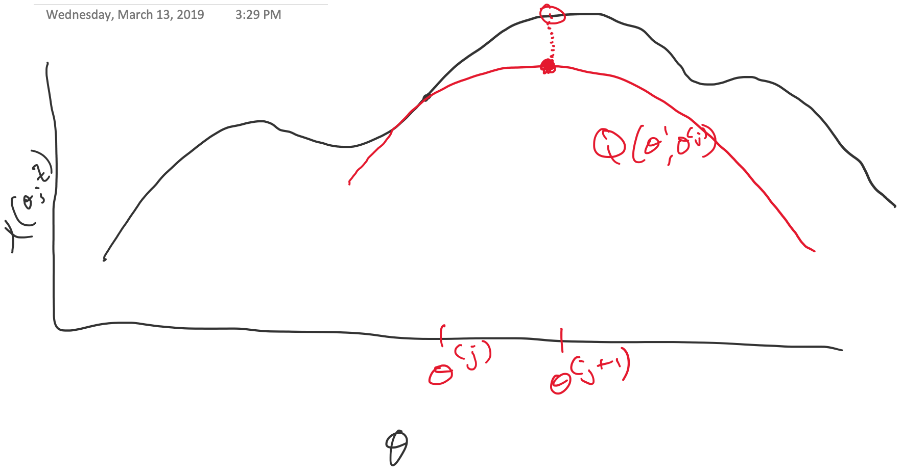
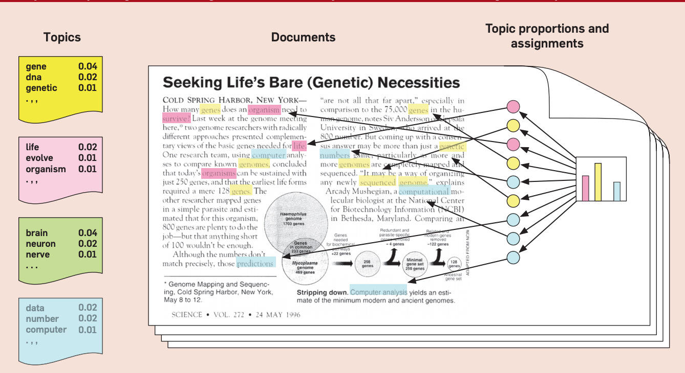

class: title-slide, center, middle
count: false

```{r cowplot_setup, echo=FALSE, message=FALSE}
library(cowplot)
```

.banner[]

.title[Algorithms for Data Science: The EM Algorithm]

.author[Héctor Corrada Bravo]

.other-info[
University of Maryland, College Park, USA  
DATA 606: `r Sys.Date()`
]

.logo[]

---
exclude: true

## Motivating Example

Time series dataset of mortgage affordability
as calculated and distributed by Zillow: https://www.zillow.com/research/data/. 

```{r clustering_setup, echo=FALSE, message=FALSE, warning=FALSE}
library(tidyverse)
library(readr)
library(lubridate)

datadir <- "data"
url <- "http://files.zillowstatic.com/research/public/Affordability_Wide_2017Q1_Public.csv"
filename <- basename(url)
datafile <- file.path(datadir, filename)

if (!file.exists(datafile)) {
  download.file(url, file.path(datadir, filename))
}

afford_data <- read_csv(datafile)
```

```{r tidy_zillow, echo=FALSE, cache=TRUE}
tidy_afford <- afford_data %>%
  filter(Index == "Mortgage Affordability") %>% 
  drop_na() %>%
  filter(RegionID != 0) %>%
  dplyr::select(RegionID, matches("^[1|2]")) %>%
  gather(time, affordability, matches("^[1|2]")) %>%
  type_convert(col_types=cols(time=col_date(format="%Y-%m")))

wide_afford_df <- tidy_afford %>%
  dplyr::select(RegionID, time, affordability) %>%
  spread(time, affordability)

value_mat <-  wide_afford_df %>%
  dplyr::select(-RegionID) %>%
  as.matrix() 
```

```{r zillow_stats, echo=FALSE}
ncounties <- nrow(wide_afford_df)
year_range <- range(year(tidy_afford$time))
```

The dataset consists of monthly mortgage affordability values for `r ncounties` counties with data from `r min(year_range)` to `r max(year_range)`. 

---
exclude: true

## Motivating Example

> "To calculate mortgage affordability, we first calculate the mortgage payment for the median-valued home in a metropolitan area by using the metro-level Zillow Home Value Index for a given quarter and the 30-year fixed mortgage interest rate during that time period, provided by the Freddie Mac Primary Mortgage Market Survey (based on a 20 percent down payment)."

---
exclude: true

## Motivating Example

> "Then, we consider what portion of the monthly median household income (U.S. Census) goes toward this monthly mortgage payment. Median household income is available with a lag. "

---
class: split-60
exclude: true

## Motivating Example

.column[
```{r zillow_plot1, echo=FALSE, cache=FALSE, warning=FALSE, fig.align="center"}
tidy_afford %>%
  ggplot(aes(x=time,y=affordability,group=factor(RegionID))) +
  geom_line(color="GRAY", alpha=3/4, size=1/2) +
  labs(title="County-Level Mortgage Affordability over Time",
          x="Date", y="Mortgage Affordability")
```
]

.column[Can we partition counties into groups of counties with similar value trends across time?]

---
layout: false

## Soft K-means Clustering

Instead of the combinatorial approach of the $K$-means algorithm, take a more direct probabilistic approach to modeling distribution $P(X)$. 

Assume each of the $K$ clusters corresponds to a multivariate distribution $P_k(X)$, 

$P(X)$ is then a _mixture_ of these distributions as $P(X)=\sum_{k=1}^K \pi_k P_k(X)$. 

---

## Soft K-means Clustering

Specifically, take $P_k(X)$ as a multivariate normal distribution $f_k(X) = N(\mu_k, \sigma_k^2 I)$ 

and mixture density 
$f(X) = \sum_{k=1}^K \pi_k f_k(X)$. 

---

## Soft K-means Clustering

Use Maximum Likelihood to estimate parameters
$$\theta=(\mu_1, \ldots,\mu_K,\sigma_1^2,\ldots,\sigma_K^2,\pi_1,\ldots,\pi_K)$$ 

based on their log-likelihood
$$\ell(\theta;X) = \sum_{i=1}^N \log \left[ \sum_{k=1}^K \pi_k f_k(x_i;\theta) \right]$$

---

## Soft K-means Clustering

$$\ell(\theta;X) = \sum_{i=1}^N \log \left[ \sum_{k=1}^K \pi_k f_k(x_i;\theta) \right]$$

Maximizing this likelihood directly is computationally difficult

Use Expectation Maximization algorithm (EM) instead. 

---

## Example: Mixture of Two Univariate Gaussians

```{r, echo=FALSE, fig.align="center",fig.width=10}
mu1 = 1
s1 = 1
mu2 = -1
s2 = sqrt(3)
pi1 = .6
pi2 = .4

draw <- function(n=1000) {
  delta <- rbernoulli(n, pi1)
  mu <- ifelse(delta == 0, mu1, mu2)
  s <- ifelse(delta == 0, s1, s2)
  rnorm(n, mean = mu, sd = s)
}

set.seed(1234)
x <- draw()

curve(pi1*dnorm(x,mean=mu1,sd=s1) + pi2*dnorm(x,mean=mu2,sd=s2),from=-6,to=4,ylab = "density",cex.axis=1.5,cex.lab=1.7)
curve(pi1*dnorm(x, mean = mu1, sd=s1), from=-6,to=5,col="red",add=TRUE,lty=2)
curve(pi2*dnorm(x, mean = mu2, sd=s2), from=-6,to=5,col="blue",add=TRUE,lty=2)

```

---

## Soft K-means Clustering

Consider unobserved latent variables $\Delta_{ik}$ taking values 0 or 1, 

$\Delta_{ij}=1$ specifies observation $x_i$ was generated by component $k$ of the mixture distribution.

---

## Soft K-means Clustering

Now set $Pr(\Delta_{ik}=1)=\pi_{k}$,and assume we _observed_ values for latent variables $\Delta_{ik}$. 

We can write the log-likelihood in this case as

$$\ell_0(\theta; X, \Delta) = \sum_{i=1}^N \sum_{k=1}^K \Delta_{ik} \log f_k(x_i; \theta) + \sum_{i=1}^N \sum_{k=1}^K \Delta_{ik} \log \pi_{k}$$

---

## Soft K-means Clustering

We have closed-form solutions for maximum likelihood estimates: 

$\hat{\mu}_k = \frac{\sum_{i=1}^N \Delta_{ik} x_i}{\sum_{i=1}^N\Delta_{ik}}$ 

$\hat{\sigma}_k^2 = \frac{\sum_{i=1}^N \Delta_{ik} (x_i-\hat{\mu}_k)^2}{\sum_{i=1}^N \Delta_{ik}}$

$\hat{\pi}_k=\frac{\sum_{i=1}^K \Delta_{ik}}{N}$.


---
layout: true

## Constrained optimization

---

We have a problem of type 

$$
\begin{array}
{} \mathrm{min}_x & f_0(x) \\
\textrm{s.t.} & f_i(x) \leq 0 \; i=1,\ldots,m \\
{} & h_i(x) = 0\; i=1,\ldots,p
\end{array}
$$

Note: This discussion follows Boyd and Vandenberghe, _Convex Optimization_

---

To solve these type of problems we will look at the _Lagrangian_ function:

$$L(x,\lambda,\nu) = f_0(x) + \sum_{i=1}^m \lambda_i f_i(x) + \sum_{i=1}^p \nu_i g_i(x)$$

---

There is a beautiful result giving _optimality conditions_ based on the Lagrangian:

Suppose $\tilde{x}$, $\tilde{\lambda}$ and $\tilde{\nu}$ are _optimal_, then

$$
\begin{array}
{} f_i(\tilde{x}) \leq 0 \\
h_i(\tilde{x}) = 0 \\
\tilde{\lambda_i} \geq 0 \\
\tilde{\lambda_i}f_i(\tilde{x}) = 0 \\
\nabla L(\tilde{x},\tilde{\lambda},\tilde{\nu}) = 0
\end{array}
$$
---

We can use the gradient and feasibility conditions to prove the MLE result.

---

## Soft K-means Clustering

Of course, this result depends on observing values for $\Delta_{ik}$ which _we don't observe_. Use an iterative approach as well: 

- given current estimate of parameters $\theta$,  
- Substitute $E[\Delta_{ik}|X_i,\theta]$ for $\Delta_{ik}$. 

--

We will prove that this maximizes the likelihood we need $\ell(\theta;X)$. 

---

## Soft K-means Clustering

In the mixture case, what does this look like? 

Define

$$\gamma_{ik}(\theta) = E(\Delta_{ik}|X_i,\theta) = Pr(\Delta_{ik}=1|X_i,\theta)$$

---

## Soft K-means Clustering


Use Bayes' Rule to write this in terms of the multivariate normal densities with respect to current estimates $\theta$:

\begin{aligned}
\gamma_{ik} & = \frac{Pr(X_i|\Delta_{ik}=1)Pr(\Delta_{ik}=1)}{Pr(X_i)} \\
{} & = \frac{f_k(x_i;\mu_k,\sigma_k^2)\pi_k}{\sum_{l=1}^K f_l(x_i; \mu_l,\sigma_l^2)\pi_l}
\end{aligned}

---

## Soft K-means Clustering

Quantity $\gamma_{ik}(\theta)$ is referred to as the _responsibility_ of cluster $k$ for observation $i$, according to current parameter estimate $\theta$. 

---
exclude: true

## Soft K-means Clustering

Then the expectation we are maximizing is given by

$$E(\ell_0(\theta'; X, \Delta)| X, \theta) = 
\sum_{i=1}^N \sum_{k=1}^K \gamma_{ik}(\theta) \log f_k(x_i; \theta') +
\sum_{i=1}^N \sum_{k=1}^K \gamma_{ik}(\theta) \log \pi'_k$$

---

## Soft K-means Clustering

We can now give a complete specification of the EM algorithm for mixture model clustering.

1.  Take initial guesses for parameters $\theta$  
2.  _Expectation Step_: Compute responsibilities $\gamma_{ik}(\theta)$
3.  _Maximization Step_: Estimate new parameters based on responsibilities as below.
4.  Iterate steps 2 and 3 until convergence

---

## Soft K-means Algorithm

Estimates in the Maximization step are given by

$$\hat{\mu}_k = \frac{\sum_{i=1}^N \gamma_{ik}(\theta) x_i}{\sum_{i=1}^N \gamma_{ik}}$$

$$\hat{\sigma}_k^2 = \frac{\sum_{i=1}^N \gamma_{ik}(\theta)(x_i-\mu_k)^2}{\sum_{i=1}^N\gamma_{ik}(\theta)}$$

and 

$$\hat{\pi}_k = \frac{\sum_{i=1}^N\gamma_{ik}(\theta)}{N}$$

---

## Soft K-means Algorithm

The name "soft" K-means refers to the fact that parameter estimates for each cluster are obtained by weighted averages across all observations.

---
layout: true
## The EM Algorithm in General

---

So, why does that work?

Why does plugging in $\gamma_{ik}(\theta)$ for the latent variables $\Delta_{ik}$ work?

Why does that maximize log-likelihood $\ell(\theta;X)$?

---

Think of it as follows:

$Z$: observed data  
$Z^m$: missing _latent_ data
$T=(Z,Z^m)$: complete data (observed and missing)

--

$\ell(\theta';Z)$: log-likehood w.r.t.  *observed* data  
$\ell_0(\theta';T)$: log-likelihood w.r.t. *complete* data

---

Next, notice that

$$
Pr(Z|\theta') = \frac{Pr(T|\theta')}{Pr(Z^m|Z,\theta')}
$$

--

As likelihood:

$$
\ell(\theta';Z) = \ell_0(\theta';T) - \ell_1(\theta';Z^m|Z)
$$

---

Iterative approach: given parameters $\theta$ take expectation of log-likelihoods

$$
\begin{array}
\, \ell(\theta';Z) & = & E[\ell_0(\theta';T)|Z,\theta] - E[\ell_1(\theta';Z^m|Z)|Z,\theta] \\
{} & \equiv & Q(\theta',\theta) - R(\theta',\theta)
\end{array}
$$

--

In soft k-means, $Q(\theta',\theta)$ is the log likelihood of complete data with $\Delta_{ik}$ replaced by $\gamma_{ik}(\theta)$

---

The general EM algorithm

1. Initialize parameters $\theta^{(0)}$  
2. Construct _function_ $Q(\theta',\theta^{(j)})$  
3. Find next set of parameters $\theta^{(j+1)} = \arg \max_{\theta'} Q(\theta', \theta^{(j)})$  
4. Iterate steps 2 and 3 until convergence  

---

So, why does that work?

$$
\begin{aligned}
\ell(\theta^{(j+1)};Z) - \ell(\theta^{(j)};Z) & = &
[Q(\theta^{(j+1)},\theta^{(j)}) - Q(\theta^{(j)},\theta^{(j)})] \\ 
{} & {} & - [R(\theta^{(j+1)},\theta^{(j)})-R(\theta^{(j)},\theta^{(j)})] \\
{} & \geq & 0
\end{aligned}
$$

--

I.E., every step makes log-likehood larger

---

Why else does it work? $Q(\theta',\theta)$ _minorizes_ $\ell(\theta';Z)$

```{r, echo=FALSE, fig.width=1}

```

---

General algorithmic concept:

Iterative approach:
  - Initialize parameters
  - Construct bound based on current parameters
  - Optimize bound
  
  
---
layout: false

## Imputing missing data

$Z$: observed data  
$Z^m$: missing observations

Requires a likelihood model...

---
layout: true

## Latent semantic analysis

---

Documents as _mixtures_ of topics (Hoffman 1998) 

```{r, echo=FALSE, fig.height=4}

```

---

Notation:

We have a set of documents $D$

Each document modeled as a bag-of-words (bow) over dictionary $W$.

$x_{w,d}$: the number of times word $w \in W$ appears in document $d \in D$.

---

Let's start with a simple model based on the frequency of word occurrences.

Each document is modeled as $n_d$ draws from a _Multinomial_ distribution with parameters $\theta_d = \{ \theta_{1,d}, \ldots, \theta_{W,d} \}$

Note $\theta_{w,d} \geq 0$ and $\sum_{w} \theta_{w,d} = 1$.

---

_Probability of observed corpus $D$_

$$Pr(D|\{ \theta_d \} ) \propto \prod_{d=1}^D \prod_{w=1}^W \theta_{w,d}^{x_{w,d}}$$


---

## Problem 1:

Prove MLE $\hat{\theta}_{w,d} = \frac{x_{w,d}}{n_d}$


