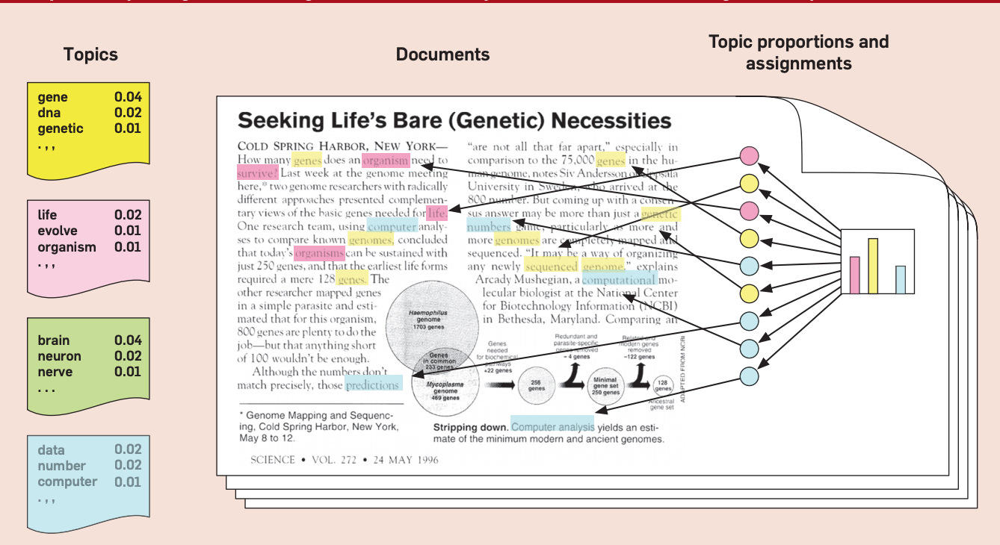
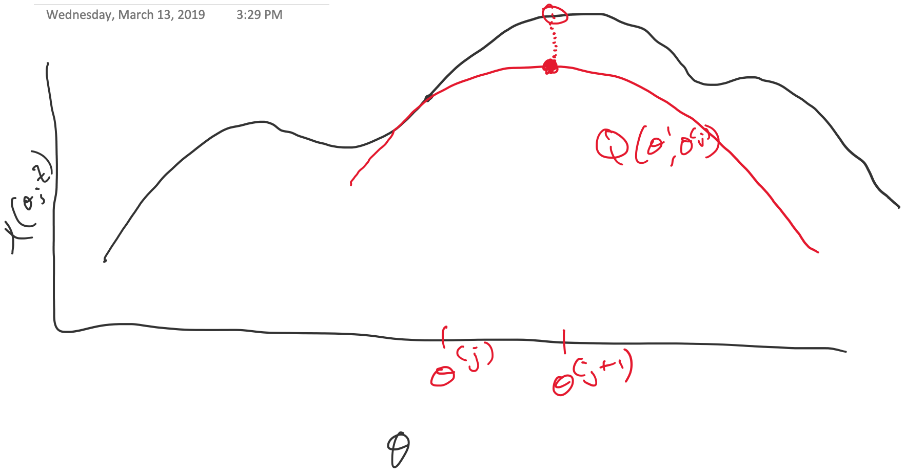
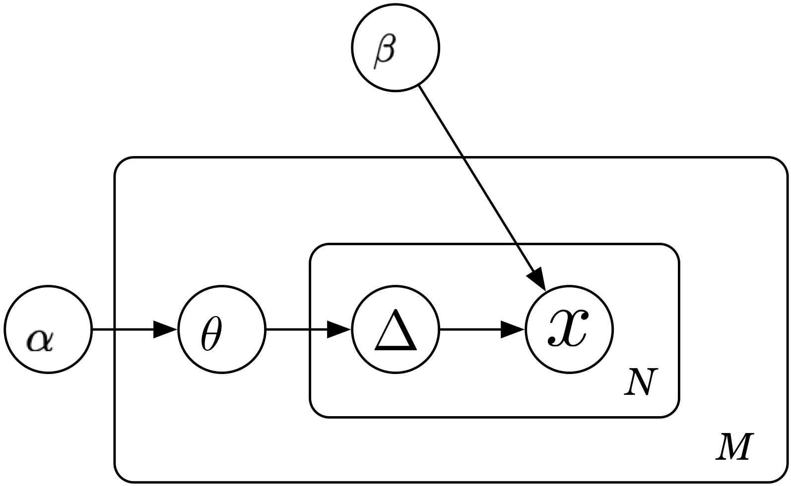

class: title-slide, center, middle
count: false

```{r cowplot_setup, echo=FALSE, message=FALSE}
library(cowplot)
```

.banner[]

.title[Gibbs Sampling]

.author[Héctor Corrada Bravo]

.other-info[
University of Maryland, College Park, USA  
CMSC 644: `r Sys.Date()`
]

.logo[]

---
layout: true

## Latent semantic analysis

---

Documents as _mixtures_ of topics (Hoffman 1999) 

```{r, echo=FALSE}

```

---
Notation:

We have a set of documents $D$

Each document modeled as a bag-of-words (bow) over dictionary $W$.

$x_{w,d}$: the number of times word $w \in W$ appears in document $d \in D$.

---

Let's start with a simple model based on the frequency of word occurrences.

Each document is modeled as $n_d$ draws from a _Multinomial_ distribution with parameters $\theta_d = \{ \theta_{1,d}, \ldots, \theta_{W,d} \}$

Note $\theta_{w,d} \geq 0$ and $\sum_{w} \theta_{w,d} = 1$.

---

_Probability of observed corpus $D$_

$$Pr(D|\{ \theta_d \} ) \propto \prod_{d=1}^D \prod_{w=1}^W \theta_{w,d}^{x_{w,d}}$$


---

## Problem 1:

Prove MLE $\hat{\theta}_{w,d} = \frac{x_{w,d}}{n_d}$

---
layout: true

## Constrained optimization

---

We have a problem of type 

$$
\begin{array}
{} \mathrm{min}_x & f_0(x) \\
\textrm{s.t.} & f_i(x) \leq 0 \; i=1,\ldots,m \\
{} & h_i(x) = 0\; i=1,\ldots,p
\end{array}
$$

Note: This discussion follows Boyd and Vandenberghe, _Convex Optimization_

---

To solve these type of problems we will look at the _Lagrangian_ function:

$$L(x,\lambda,\nu) = f_0(x) + \sum_{i=1}^m \lambda_i f_i(x) + \sum_{i=1}^p \nu_i g_i(x)$$

---

We'll see these in more detail later, but there is a beautiful result giving _optimality conditions_ based on the Lagrangian:

Suppose $\tilde{x}$, $\tilde{\lambda}$ and $\tilde{\nu}$ are _optimal_, then

$$
\begin{array}
{} f_i(\tilde{x}) \leq 0 \\
h_i(\tilde{x}) = 0 \\
\tilde{\lambda_i} \geq 0 \\
\tilde{\lambda_i}f_i(\tilde{x}) = 0 \\
\nabla L(\tilde{x},\tilde{\lambda},\tilde{\nu}) = 0
\end{array}
$$
---

We can use the gradient and feasibility conditions to prove the MLE result.

---
layout: true

## Probablistic Latent Semantic Analysis

---

Let's change our document model to introduce topics. 

The key idea is that the probability of observing a _word_ in a _document_ is given by two pieces:

- The probability of observing a _topic_ in a document, and  
- The probability of observing a _word_ given a _topic_

$$
Pr(w,d) = \sum_{t=1}^T Pr(w|t)Pr(t|d)
$$

---

So, we rewrite corpus probability as

$$Pr(D|\{p_d\} \{\theta_t\}) \propto \prod_{d=1}^D \prod_{w=1}^W \left( \sum_{t=1}^T p_{t,d} \theta_{w,t} \right)^{x_{w,d}}$$

--

**Mixture of topics!!**

---

### A fully observed model

Assume you know the _latent_ number of occurences of word $w$ in document $d$ generated from topic $t$: 

$\Delta_{w,d,t}$, such that $\sum_t \Delta_{w,d,t} = x_{w,d}$.

In that case we can rewrite corpus probability:

$$Pr(D|\{p_d\},\{\theta_t\}) \propto \prod_{d=1}^D \prod_{w=1}^W \prod_{t=1}^T (p_{t,d}\theta_{w,t})^{\Delta_{w,d,t}}$$

---

**Problem 2** Show MLEs given by

$$\hat{p}_{t,d} = \frac{ \sum_{w=1}^W \Delta_{w,d,t} }{ \sum_{t=1}^T \sum_{w=1}^W \Delta_{w,d,t}}$$

$$\hat{\theta}_{t,d} = \frac{ \sum_{d=1}^D \Delta_{w,d,t}}{\sum_{w=1}^W \sum_{d=1}^D \Delta_{w,d,t}}$$

---

Since we don't observe $\Delta_{w,d,t}$ we use the EM algorithm

At each iteration (given current parameters $\{p_d\}$ and $\{\theta_d\}$ find _responsibility_

$$\gamma_{w,d,t} = E[\Delta_{w,d,t} | \{p_d\}, \{\theta_t\}]$$

and maximize fully observed likelihood plugging in $\gamma_{w,d,t}$ for $\Delta_{w,d,t}$

---

**Problem 4**: Show

$$\gamma_{w,d,t} = x_{w,d} \times \frac{ p_{t,d} \theta_{w,t} }{\sum_{t'=1}^T p_{t',d} \theta_{w,t'}}$$

---
layout: true

## The EM Algorithm in General

---

So, why does that work?

Why does plugging in $\gamma_{w,d,t}$ for the latent variables $\Delta_{w,d,t}$ work?

Why does that maximize log-likelihood $\ell(\{p_d\},\{\theta_t\};D)$?

---

Think of it as follows:

$Z$: observed data  
$Z^m$: missing _latent_ data
$T=(Z,Z^m)$: complete data (observed and missing)

--

$\ell(\theta';Z)$: log-likehood w.r.t.  *observed* data  
$\ell_0(\theta';T)$: log-likelihood w.r.t. *complete* data

---

Next, notice that

$$
Pr(Z|\theta') = \frac{Pr(T|\theta')}{Pr(Z^m|Z,\theta')}
$$

--

As likelihood:

$$
\ell(\theta';Z) = \ell_0(\theta';T) - \ell_1(\theta';Z^m|Z)
$$

---

Iterative approach: given parameters $\theta$ take expectation of log-likelihoods

$$
\begin{array}
\, \ell(\theta';Z) & = & E[\ell_0(\theta';T)|Z,\theta] - E[\ell_1(\theta';Z^m|Z)|Z,\theta] \\
{} & \equiv & Q(\theta',\theta) - R(\theta',\theta)
\end{array}
$$

--

In pLSA, $Q(\theta',\theta)$ is the log likelihood of complete data with $\Delta_{w,d,t}$ replaced by $\gamma_{w,d,t}$

---

The general EM algorithm

1. Initialize parameters $\theta^{(0)}$  
2. Construct _function_ $Q(\theta',\theta^{(j)})$  
3. Find next set of parameters $\theta^{(j+1)} = \arg \max_{\theta'} Q(\theta', \theta^{(j)})$  
4. Iterate steps 2 and 3 until convergence  

---

So, why does that work?

$$
\begin{aligned}
\ell(\theta^{(j+1)};Z) - \ell(\theta^{(j)};Z) & = &
[Q(\theta^{(j+1)},\theta^{(j)}) - Q(\theta^{(j)},\theta^{(j)})] \\ 
{} & {} & - [R(\theta^{(j+1)},\theta^{(j)})-R(\theta^{(j)},\theta^{(j)})] \\
{} & \geq & 0
\end{aligned}
$$

--

I.E., every step makes log-likehood larger

---

Why else does it work? $Q(\theta',\theta)$ _minorizes_ $\ell(\theta';Z)$

```{r, echo=FALSE, fig.width=1}

```

---

General algorithmic concept:

Iterative approach:
  - Initialize parameters
  - Construct bound based on current parameters
  - Optimize bound

--

We will see this again when we look at _variational_ methods

---
layout: true

## Approximate Inference by Sampling

---

Ultimately, what we are interested in is learning topics

Perhaps instead of finding parameters $\theta$ that maximize likelihood 

Sample from a distribution $Pr(\theta | D)$ that gives us topic estimates

--

But, we only have talked about $Pr(D|\theta)$ how can we sample parameters?

---

Like EM, the trick here is to expand model with _latent_ data $Z^m$

And sample from distribution $Pr(\theta,Z^m|Z)$

--

This is challenging, but sampling from $Pr(\theta|Z^m,Z)$ and $Pr(Z^m|\theta,Z)$ is easier

---

The _Gibbs Sampler_ does exactly that

_Property_: After some rounds, samples from the conditional distributions $Pr(\theta|Z^m,Z)$ 

Correspond to samples from 
marginal $Pr(\theta|Z) = \sum_{Z^m} Pr(\theta,Z^m|Z)$

---

Quick aside, how to simulate data for pLSA?

- Generate parameters $\{p_d\}$ and $\{\theta_t\}$
- Generate $\Delta_{w,d,t}$

---

Let's go backwards, let's deal with $\Delta_{w,d,t}$

--

$$\Delta_{w,d,t} \sim \mathrm{Mult_{x_{w,d}}}(\gamma_{w,d,1},\ldots,\gamma_{w,d,T})$$

Where $\gamma_{w,d,t}$ was as given by E-step

--

```python
for d in range(num_docs):
  delta[d,w,:] = np.random.multinomial(doc_mat[d,w],
      gamma[d,w,:])
```

---

Hmm, that's a problem since we need $x_{w,d}$...

But, we know $Pr(w,d)=\sum_t p_{t,d}\theta_{w,t}$ so, let's use that to generate each $x_{w,d}$ as 

$$x_{w,d} \sim \mathrm{Mult}_{n_d}(Pr(1,d),\ldots,Pr(W,d))$$

--

```python
for d in range(num_docs):
  doc_mat[d,:] = np.random.multinomial(nw[d], np.sum(p[:,d] * theta), axis=0)
```

---

Now, how about $p_d$? How do we generate the parameters of a Multinomial distribution?

--

This is where the Dirichlet distribution comes in...

If $p_d \sim \mathrm{Dir}(\alpha)$, then

$$Pr(p_d) \propto \prod_{t=1}^T p_{t,d}^{\alpha_t-1}$$

---

Some interesting properties:

$$E[p_{t,d}] = \frac{\alpha_t}{\sum_{t'} \alpha_{t'}}$$

So, if we set all $\alpha_t=1$ we will tend to have uniform probability over topics ( $1/t$ each on average)

If we increase $\alpha_t=100$ it will also have uniform probability but will have very little variance (it will almost always be $1/t$)

---

So, we can say $p_d \sim \mathrm{Dir}(\alpha)$ and $\theta_t \sim \mathrm{Dir}(\beta)$

--

And generate data as (with $\alpha_t=1$)

```python
for d in range(num_docs):
  p[:,d] = np.random.dirichlet(1. * np.ones(num_topics))
```

---

So what we have is a _prior_ over parameters $\{p_d\}$ and $\{\theta_t\}$: $Pr(p_d|\alpha)$ and $Pr(\theta_t|\beta)$

And we can formulate a distribution for missing data $\Delta_{w,d,t}$: 

$$Pr(\Delta_{w,d,t}|p_d,\theta_t,\alpha,\beta) = \\
Pr(\Delta_{w,d,t}|p_d,\theta_t)Pr(p_d|\alpha)Pr(\theta_t|\beta)$$

---

However, what we care about is the _posterior_ distribution 
$Pr(p_d|\Delta_{w,d,t},\theta_t,\alpha,\beta)$

What do we do???

---

Another neat property of the Dirichlet distribution is that it is _conjugate_ to the Multinomial

If $\theta|\alpha \sim \mathrm{Dir}(\alpha)$ and $X|\theta \sim \mathrm{Multinomial}(\theta)$, then

$\theta|X,\alpha \sim \mathrm{Dir}(X+\alpha)$

---

That means we can sample $p_d$ from

$$p_{t,d} \sim \mathrm{Dir}(\sum_w \Delta_{w,d,t} + \alpha)$$

and

$$\theta_{w,t} \sim \mathrm{Dir}(\sum_d \Delta_{w,d,t} + \beta)$$

---

Coincidentally, we have just specified the **Latent Dirichlet Allocation** method for topic modeling.

This is the most commonly used method for topic modeling

```{r, echo=FALSE, out.width='40%', fig.align="center"}

```

.source[Blei, Ng, Jordan (2003), JMLR]

---

We can now specify a full Gibbs Sampler for an LDA mixture model.

Given: 
  - Word-document counts $x_{w,d}$ 
  - Number of topics $K$
  - Prior parameters $\alpha$ and $\beta$
  
Do: Learn parameters $\{ p_d \}$ and $\{\theta_t\}$ for $K$ topics

---

Step 0: Initialize parameters $\{p_d\}$ and $\{\theta_t\}$

$$
p_d \sim \mathrm{Dir}(\alpha)
$$

and

$$
\theta_t \sim \mathrm{Dir}(\beta)
$$

---

Step 1:

Sample $\Delta_{w,d,t}$ based on current parameters $\{p_d\}$ and $\{ \theta_t \}$

$$\Delta_{w,d,.} \sim \mathrm{Mult}_{x_{w,d}}(\gamma_{w,d,1},\ldots,\gamma_{w,d,T})$$

---

Step 2:

Sample parameters from

$$p_{t,d} \sim \mathrm{Dir}(\sum_w \Delta_{w,d,t} + \alpha)$$

and

$$\theta_{w,t} \sim \mathrm{Dir}(\sum_d \Delta_{w,d,t} + \beta)$$

---

Step 3:

Get samples for a few iterations (e.g., 200), we want to reach a stationary distribution...

---

Step 4:

Estimate $\hat{\Delta}_{w,d,t}$ as the average of the estimates from the last $m$ iterations (e.g., m=500)

---

Step 5:

Estimate parameters $p_d$ and $\theta_t$ based on estimated $\hat{\Delta}_{w,d,t}$

$$\hat{p}_{t,d} = \frac{\sum_w \hat{\Delta}_{w,d,t} + \alpha}{\sum_t \sum_w \hat{\Delta}_{w,d,t} + \alpha}$$

$$\hat{\theta}_{w,t} = \frac{\sum_d \hat{\Delta}_{w,d,t} + \beta}{\sum_w \sum_d \hat{\Delta}_{w,d,t} + \beta}$$

---
layout: true

## Mixture models

---

We have now seen two different mixture models: soft k-means and topic models

--

Two inference procedures: 
  - Exact Inference with Maximum Likelihood using the EM algorithm
  - Approximate Inference using Gibbs Sampling

--

Next, we will go back to Maximum Likelihood but learn about Approximate Inference using Variational Methods


