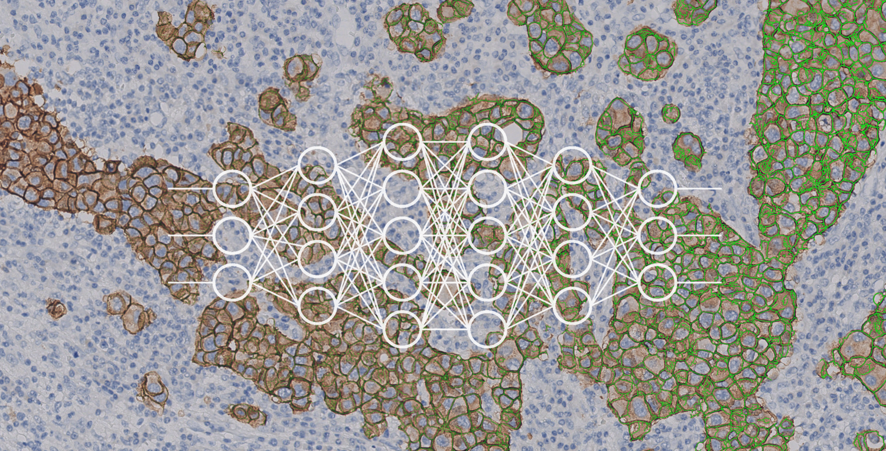

class: title-slide, center, middle
count: false

.banner[]

.title[Algorithms for Data Science: Overview]

.author[Héctor Corrada Bravo]

.other-info[
University of Maryland, College Park, USA  
DATA 606: `r Sys.Date()`
]

.logo[]

---
## Course Organization

### Course Webpage

- Shortened: http://bit.ly/hcb-dsalgo

### Other Sites

- **ELMS**: Grades, assignments, etc. 

Links in course webpage

---
exclude: true

## UMD Data Science Certificate

- CSMC 641: Principles of Data Science
- CMSC 642: Big Data Systems
- **CMSC 643: Machine Learning and Data Mining**
- CMSC 644: Algorithms for Data Science

---
class: split-50

## Data Science in the modern world


.column[
**ML: Self-driving cars**


**Networks: Social Media**
.image-70[]
]

.column[
**ML: Medical Diagnosis**
.image-30[]

**Data Mining: Smart Cities**

]

---

## Introduction and Preliminaries

-  What is Data Science, what is it useful for;  
-  types of Data Science problems and the algorithms behind their solutions;    

-  challenges in application of Data Science methods;  
-  ethical and fair application of Data Science;
-  deployment of Data Science algorithms

---

## Structure

- Coding projects (Python)
- Problem sets
- Written final 

- Tuesdays 6:00-9:30pm CSIC 2118

---
class: inverse, middle, center

# Introduction and Overview

---
class: middle, center

# A Data Science Problem: Prediction

.large[Create a computational system that predicts outcomes from the data observations] 

---
layout: true

## A Data Science Problem: Prediction

---

Suppose we want to predict if customer Bob has health insurance. 

We can make use of attributes about Bob, e.g., 
  - Bob's age, 
  - Bob's wage, 
  - Bob's level of education, 
  
and try to **predict** if Bob has health insurance. 

---

### First Attempt: Hand-made ruleset

Create a set of rules that lets us predict if customers have health insurance. 

--

Example - "customers with only a High School diploma  that make less than 25,000 dollars a year will not have insurance". 

---

### First Attempt: Hand-made ruleset

- Takes a lot of expertise to create such a rulebase 

--

- Takes a lot of work to maintain it too: what if we get new attributes about customers?

--

- What to do with attributes that are much harder to deal with, e.g., Bob's LinkedIn activity?   

---

### Second Attempt: Instance-based Predictions

Gather data about customers, those that have health insurance and those that do not 

--

predict based on customers that have the same attribute values 

---

### Second Attempt: Instance-based Predictions

Suppose Alice is a past customer. She has 
  - the same age as Bob, 
  - the same wage as Bob, 
  - the same education level as Bob 
  - and has health insurance. 
 
--

Then predict that Bob will also have health insurance. 

---

What if there is no customer Alice, that is, there is no customer that has exactly the same attributes as Bob?

--

Even if we were able to make accurate predictions this way, have we gained any insight about customers and why they may have health insurance?

---

.center[In Data Science we build systems that use existing data, **training data**, to create a model that predicts a particular outcome]

---
exclude: true

Arthur Samuel defined Machine Learning as

> the field of study that gives computers the ability to learn without being explicitly programmed

---
exclude: true

In our example, the rulebased system is a computational system that is _explicitly programmed_. 

--
exclude: true

Instead, ML creates systems that learn from examples 

--
exclude: true

- examples: data from previous instances 

---
layout: false

## Two Flavors of Data Science

**Machine Learning**: use probabilistic and statistical principles to build systems that _learn_ from examples  

**Data Mining**: use computational approaches to answer complex queries about data

---

## Data Mining

- Summarization: effectively summarize large collections of data
  - e.g., Google PageRank algorithm as summary of World Wide Web
  - e.g., clustering as a way to summarize collections of data into smaller groups
  
- Feature extraction: find most prominent features of the data
  - e.g., frequent itemsets
  - e.g., similar items
  
---
layout: true

## Why use Data Science?

--

- Building rule systems that capture non-trivial patterns in data require substantial expertise

--

- Using attributes like social media activity, is very difficult to encode in explicit programs. 

---

There is _natural, non-reducible, variation_ in the tasks we are trying to model. 

--

Even if Bob and Alice are exactly alike according to the attributes we have measured, 

Bob may have health insurance while Alice does not due to reasons we are not aware of. 

---

Capturing this type of natural variation is very difficult in rule-based systems

Data Science models (ML in particular) try to capture it as stochastic behavior.

---

Data Science systems can help human users gain insights. 

--

In cases where instances are measured by a large amount of attributes, 

--

ML systems can identify attributes that are important for prediction, 

--

Users can then in turn study further to understand the relationship between these attributes and the outcome of interest.

---
layout: true

## An illustrative example

---

Suppose I have training data from customers and want to model health insurance status 

```{r ch1_setup, echo=FALSE, message=FALSE, warning=FALSE}
library(tidyverse)
library(ISLR)
library(cowplot)
library(forcats)
library(kableExtra)

theme_set(theme_bw())
```

```{r ch1_prepdata, cache=TRUE, echo=FALSE, warning=FALSE}
data(Wage)
clean_df <- Wage %>%
  mutate(age_group=cut(age, breaks=3),
         wage_group=cut(logwage, breaks=3)) %>%
  mutate(health_ins=fct_rev(health_ins)) %>%
  select(-year,-region,-logwage,-wage,-age)

plot_df <- clean_df %>%
  gather(attr,val,-health_ins) %>%
  count(attr,val,health_ins) %>%
  group_by(attr, val) %>%
  mutate(pct=100 * n / sum(n)) 
```

```{r ch1_wagedata, echo=FALSE}
clean_df %>%
  select(1:4,health_ins) %>%
  head(5) %>%
  knitr::kable(format='html') #%>%
#  kable_styling(bootstrap_options=c("striped"))
```

---

A first simple rule is to predict health status from the majority of the training instances.

```{r ch1_overall, echo=FALSE, fig.align='center', fig.height=4}
clean_df %>%
  count(health_ins) %>%
  mutate(percent=100 * n/sum(n)) %>%
  ggplot(aes(x=health_ins,y=percent,fill=health_ins)) +
    geom_col()
```

--

We would be wrong about 30% of new customers (assuming we see the same rate of insurance). 

---

### How can we do better? 

If the rate of insurance changes depending on other attributes, we can adjust our prediction accordingly. 

In this case, we see that the rate of insurance changes significantly depending on the other measured attributes. 

---

```{r ch1_attributes, echo=FALSE, fig.height=7, fig.align='center', fig.width=12}
plot_df %>%
  group_by(attr) %>%
  do(plot = ggplot(aes(x=val,y=pct,fill=health_ins), data=.)) %>%
  rowid_to_column() %>%
  ungroup() %>%
  mutate(position=ifelse(rowid == max(rowid), "right", "none"))  %>%
  rowwise() %>%  
  do(x=.$plot + 
       geom_col() +
       labs(title=.$attr,x="value",y="percent") + 
       coord_flip() +
       theme(legend.position=.$position)) %>%
  pull(1) %>%
  plot_grid(plotlist=., nrow=2)
```

---

Perhaps the insured rate based on education level also depends on customer's wage. 

That is, there is an interaction between wage and education level that would affect our prediction of insurance status. 

---


```{r ch1_edlevel_df, echo=FALSE}
plot_df2 <- clean_df %>%
  count(wage_group, education, health_ins) %>%
  group_by(wage_group, education) %>%
  mutate(percent = n / sum(n)) %>%
  select(-n)
```

```{r ch1_edleve_plot, echo=FALSE, fig.width=11, fig.align='center', fig.height=5}
plot_df2 %>%
  ggplot(aes(x=education, y=percent, fill=health_ins)) +
  geom_col() +
  coord_flip() +
  facet_wrap(~wage_group)
```

the rate of insurance in the high earners is similar regardless of education level, whereas for mid earners, the insurance rate varies significantly depending on education level.

---

These interactions could be extended to more than two attributes.

A rule-based system that incorporates this type of interaction, would perhaps require a large number of rules if the number of attributes is very large.

---

### A DS Approach

One of the workhorse methods in Machine Learning is the Decision Tree. 

--

It is a highly interpretable model since we can think the Decision Tree algorithm as _learning_ a rule-based system consisting of multiple interaction rules over the attributes of a given dataset.

---

```{r ch1_treesetup, echo=FALSE, warning=FALSE}
library(rpart)
library(rpart.plot)
```

```{r ch1_build_tree, echo=FALSE, cache=TRUE, warning=FALSE}
dectree <- clean_df %>%
  rpart(health_ins~., data=., method="class", cp=0, minsplit=100)
```

```{r ch1_plot_tree, echo=FALSE, fig.align='center', fig.width=11, warning=FALSE}
rpart.plot(dectree, cex=1.2)
```

```{r ch1_tree_error, cache=TRUE, echo=FALSE}
tree_error <- 100 * mean(predict(dectree, type="class") != clean_df$health_ins)
```

--

The predictions given by this tree would be wrong roughly `r round(tree_error)`% of the time. 

---

Now that we have trained this Decision Tree we can deploy it to make predictions on new customers. 

--

Do we think our predictions will be incorrect 27% of the time? 

--

We'll see a little later that this may not be quite correct.

---
layout: true

## Tree models

---

So, how do we build a decision tree like this?

What's the algorithm?

.source[Leskovec Ch. 12]

---

Decision trees operate by predicting an outcome variable $Y$ (health insurance) by partitioning feature (predictor) space.

--

In general, the tree model:

1. Partitions feature space into $J$ non-overlapping regions, $R_1, R_2, \ldots, R_J$.
2. For every example that falls within region $R_j$, predict outcome as majority of outcome for training examples in $R_j$.

--

The important observation is that **Decision Trees create data partitions recursively**


---

For example, consider finding a good predictor $j$ to partition space along its axis. A recursive algorithm would look like this:

- Find predictor $j$ and value $s$ that minimize error:

$$\sum_{i:\, x_i \in R_1(j,s))} \mathrm{error}(y_i, \hat{y}_{R_1}) +
\sum_{i:\, x_i \in R_2(j,s))} \mathrm{error}(y_i, \hat{y}_{R_2})$$

Where $R_1$ and $R_2$ are regions resulting from splitting observations on predictor $j$ and value $s$:

$$
R_1(j,s) = \{X|X_j < s\} \, \mathrm{ and } \, R_2(j,s) \{X|X_j \geq s\}
$$

---

For example, consider finding a good predictor $j$ to partition space along its axis. A recursive algorithm would look like this:

- Find predictor $j$ and value $s$ that minimize RSS:

$$\sum_{i:\, x_i \in R_1(j,s))} \mathrm{error}(y_i, \hat{y}_{R_1}) +
\sum_{i:\, x_i \in R_2(j,s))} \mathrm{error}(y_i, \hat{y}_{R_2})$$

- Apply recursively to regions $R_1$ and $R_2$. 

---

Within each region a prediction $\hat{y}_{R_j}$ is made as the majority of the response $Y$ of observations in $R_j$.

---
layout: true

## Specifics of the partitioning algorithm

---

### The predictor space

Suppose we have $p$ features $X_1,\ldots,X_p$ and $n$ examples. 

--

Each of the $X_i$ can be 

a)   a numeric feature: there are $n-1$ possible splits
b)   an unordered $k$-categorical feature: $2^{k-1}-1$ possible splits.
c)   an ordered $k$-categorical feature: there are $k-1$ possible splits  

---

### Learning Algorithm

The general procedure for tree learning is the following:

**Grow**: an overly large tree using forward selection as follows: at each step, find the *best* split among all attributes. Grow until all terminal nodes either

(a) have $< m$ (perhaps $m=1$) data points  
(b) are "pure" (all points in a node have [almost] the same outcome).

---

### Learning Algorithm

The general procedure for tree learning is the following:

**Grow**: an overly large tree using forward selection 

**Prune**: the tree back decreasing in *complexity*

---

### Tree Growing

The recursive partitioning algorithm is as follows:

INITIALIZE    All example in the root node  
REPEAT	      Find optimal split; Partition examples  according to split  
STOP	        Stop when pre-defined criterion is met

---

### Tree Growing

An important issue in tree construction is how to use the training data to determine the binary splits of dataset $\mathcal{X}$ 

--

The fundamental idea is to select each split of a subset so that the data in each of the descendent subsets are "purer" than the data in the parent subset.

---

### Deviance as a measure of impurity

A simple approach is to assume a multinomial model and then use deviance as a definition of impurity.

---

### Deviance as a measure of impurity

Assume $Y \in \mathcal{G}=\{1,2,\ldots,k\}$.

*      At each node $i$ of a classification tree we have a probability
       distribution $p_{ik}$ over the $k$ classes.

*      We observe a random sample $n_{ik}$ from the multinomial
       distribution specified by the probabilities $p_{ik}$.

---

### Deviance as a measure of impurity

Assume $Y \in \mathcal{G}=\{1,2,\ldots,k\}$.

*      Given $X$, the conditional likelihood is then proportional to $\prod_{(\text{leaves } i)} \prod_{(\text{classes } k)} p_{ik}^{n_{ik}}$.

*      Estimate $p_{ik}$ by $\hat{p}_{ik}=\frac{n_{ik}}{n_i}$.

*      Define deviance $D=\sum D_i$, where $D_i=-2\sum_k n_{ik} \log(p_{ik})$.

--

Select splits that improve deviance $D$

---

### Deviance as a measure of impurity

_Quiz_ Compute deviance for the following cases

a) $n_{i1}=6, \, n_{i2}=1, \, n_{i3}=1$  
b) $n_{i1}=9, \, n_{i2}=1, \, n_{i3}=0$  
c) $n_{i1}=90, \, n_{i2}=10, \, n_{i3}=0$  

---

### Other measures of impurity

Other commonly used measures of impurity at a node $i$ of a
classification tree are

**missclasification rate**: $\frac{1}{n_i} \sum_{j\in A_i} I(y_j \neq k_i)=1-\hat{p}_{ik_i}$  
**entropy**: $\sum p_{ik} \log(p_{ik})$  
**GINI index**: $\sum_{j\neq k} p_{ij}p_{ik} = 1-\sum_k p_{ik}^2$  

where $k_i$ is the most frequent class in node $i$.

--

In practice, the GINI index is preferred

---
exclude: true

## Specifics of the partitioning algorithm

For regression trees we use the residual sum of squares:

$$D = \sum_{\text{cases } j} (y_j-\mu_{[j]})^2$$

where $\mu_{[j]}$ is the mean values in the node that case $j$ belongs
to.
---

### Algorithmic considerations

- How to select a split?
- Can process be parallelized how?

---

### Tree Pruning

*	Grow a big tree $T$
*	Consider snipping off terminal subtrees (resulting in
	so-called rooted subtrees)
*	Let $D_i$ be a measure of impurity at leaf $i$ in a
	tree. Define $D=\sum_i D_i$
*	Define size as the number leaves in a tree
*	Let $D_{\alpha} = D + \alpha \times \mathrm{size}$

--
exclude: true

The set of rooted subtrees of $T$ that minimize $D_{\alpha}$ is
nested.

---

### Tree Pruning

We can prune the tree sequentially

--

Given tree $T$, 
- for every node $R_j$ in tree, compute $D_{\alpha}$ after removing subtree rooted at $R_j$  
- select node $R_j$ that minimizes $D_{\alpha}$
- Remote subtree rooted at $R_j$ from $T$
- Continue until $D_{\alpha}$ increases


---
layout: true

## Types of Data Science Algorithms

---

Data Science algorithms can be categorized based on 

--

- the nature of the task they are trying to solve, 

--

- the way data is used build models, 

--

- and the nature of the algorithm itself. 

---
layout: true

# Types of Data Science Systems

---

## Supervised vs. Unsupervised Learning

Our running example of predicting insurance status is a _supervised_ learning problem. 

--

We have attributes over observations of interest, we want to _predict_ a specific outcome and our data measures this outcome for all observations in our training data. 

--

each instance is _labeled_ with the outcome we want to learn.

---

## Supervised vs. Unsupervised Learning

In the insurance case, the outcome is categorical (e.g., Yes/No). 

--

In general, the task of predicting a categorical outcome is called _classification_, as we are trying to classify instances into one of multiple classes. 

--

_Regression_ problems are those tasks where the outcome we are trying to predict is numerical.

---
exclude: true

| Method | Task | Session |
|--------|------|---------|
| K-Nearest Neighbors | classification or regression | Session I |
| Linear Regression | regression | Session I |
| Logistic Regression | classification | Session I | 
| Decision Trees and Random Forests | classification or regression | Session II |
| Support Vector Machines | classification or regression | Session III |
| Neural Networks  | classification or regression | Session V

---

## Supervised vs. Unsupervised Learning

In _unsupervised_ learning we are not interested in predicting an outcome, but rather trying to learn some underlying structure, or patterns, from the data. 

--

In this case, instances in our training data are _unlabeled_. 

---

## Supervised vs. Unsupervised Learning

The two most common applications in unsupervised learning are: 

### Clustering: 

partition instances into multiple groups of similar instances, 

--

### Dimensionality reduction: 

represent instances for which we have a large number of attributes using a small number of dimensions. 

---

| Method | Goal |
|--------|------|
| K-Means | clustering |
| Hierarchical clustering | clustering |
| Expectation Maximization | clustering |
| Principal Component Analysis | dimensionality reduction |
| Locally-Linear Embedding | dimensionality reduction |
| t-distributed Stochastic Neighbor Embedding (tSNE) | dimensionality reduction |

---
exclude: true

# Types of ML Systems

## Supervised vs. Unsupervised Learning

Another setting is _semi-supervised_ learning where we have labels for a portion of our training data. 

In this case, we want to use similarity between unlabeled and labeled data to learn a classification function.

---

## Batch vs. Stream Processing

In _stream processing_, we assume data for our system arrives in a stream, a small number of examples at a time. 

We want to build a system that continuously updates models as new examples arrive. 

---

## Batch vs. Stream Processing

In contrast, _batch processing_ is the case where we have all of the examples we want to use to build our system at training time. 

Batch processing is the most common use case, but
stream processing is useful for extremely large datasets.

---

## Instance vs. Model-based methods

Instance-based systems are based on directly looking up instances in a data set that are similar to the instance we want to analyze and, e.g., make prediction based on the outcomes for those similar instances. 


---

## Instance vs. Model-based methods

Model-based methods summarize training instances and learn a function based on that summary to, e.g., make predictions. 

--

### A rule of thumb: 

systems that can produce output after discarding _all_ the input data are _model-based_ systems. 

--

systems that need to keep _some_ input data to produce output are _instance-based_ methods. 

---
layout: true

## Challenges of DS Application

---

While Data Science systems and algorithms can be very powerful tools, their application can pose some problems.

---

### Insufficient data

For very complex tasks, think image or voice recognition, or cases where we have many relevant attributes, many examples are required to succesfully learn useful models or summaries.

---

### Nonrepresentative data

If the data is not representative of the examples we will analyze after deployment, then the model or summaries we create will not be very useful.

--

For example, suppose in our insurance example, all our training data is for customers under the age of 60, our model will not be able to make good predictions for customers older than 60.

---

### Poor-quality data

Data that is missing and/or incorrect will make system-building extremely difficult. 

A significant effort is usually spent cleaning data before building DS systems.

---

### Irrelevant data

Including features that are irrelevant to the analyes we want to perform make system building more difficult. 

While many methods are capable of alleviating this problem by ignoring irrelevant features, it is a good practice to not include these in data. 

---

In general, the last few problems we've mentioned can be summarized as "garbage in, garbage out", 

--

the better the data, the better the models and summaries we will get from our systems.

---

### Overfitting training data

The ultimate goal when applying ML models is to be able to make good predictions for new unobserved data based on training data. 

--

There is a danger however, that our model will learn to predict the training data so well, that it will not be able to make good predictions on new unobserved data. 

--

This problem is called "over-fitting". 

---

### Overfitting

In Decision Trees, we can characterize the complexity of the models we learn by measuring the "depth" of the tree. 

--

_Depth_ is the length of the longest path from root to leaf in the tree. 

--

In a decision tree, this is the number of tests used to make a prediction. 

--

The more tests we make, the more complex the model. 

--

If we make very deep trees we can easily overfit the data.

---

```{r ch1_overfit, echo=FALSE, cache=TRUE, fig.align='center', fig.width=16, fig.height=9}
deeptree <-  rpart(health_ins~., data=clean_df, method="class", cp=0, minsplit=20)
rpart.plot(deeptree)
```

---

## Underfitting

The opposite problem of course is under-fitting. 

In this case, the data analyst is so over-zealous about avoiding over-fitting training data that models fail to learn how to make useful predictions. 

In the decision tree case, this would result from building trees that are too shallow. 

---

```{r ch1_underfit, echo=FALSE, warning=FALSE, fig.align='center'}
shallowtree <- rpart(health_ins~., data=clean_df, method="class", maxdepth=3)
rpart.plot(shallowtree)
```

---
layout: true

## Testing and validating Data Science systems

---

Often the goal of applying DS systems is to obtain accurate predictions, or relevant patterns for future data by building models using past data. 

--

This leads to the natural questions of 

a) how do we quantify performance, and 
b) how can we estimate what that performance will be for future data. 

--

This introduces two fundamental notions in ML: the _performance metrics_ and _performance estimation_.

---

### Performance Metrics

To determine how useful are the DS systems we are building we first need to specify a metric to quantify the performance of predictions or patterns. 

--

This decision must be made specifically for the task we are targeting. 

---

### Performance Metrics

Consider our insurance case again. 

A natural metric is the _error rate_, the rate at which our system makes erroneous predictions. 

--

The first tree we built previously made wrong predictions about 27% of the time on the training set.

---

### Performance Metrics

But what if our interest in using our model is a bit more nuanced? 

What if we wanted to make sure we are able to correctly identify almost all of our customers with insurance (say 95%) while minimizing _false positives_.

---

### Confusion Matrix

For prediction, we use a more precise language to describe prediction accuracy:


|                   | True Class +        | True Class -        | Total |
|:------------------|:--------------------|:---------------------|-------:|
| **Predicted Class +** | True Positive (TP)  | False Positive (FP) | P*    |
| **Predicted Class -** | False Negative (FN) | True Negative (TN)  | N*    |
| **Total**             | P                   | N                   |       |

---

### Performance Metrics

| Name                            | Definition | Synonyms                                          |
|:-------------------------------------|:-----------|---------------------------------------------------:|
| False Positive Rate (FPR)       | FP / N     | Type-I error, 1-Specificity                       |
| True Positive Rate (TPR)        | TP / P     | 1 - Type-II error, power, sensitivity, **recall** |
| Positive Predictive Value (PPV) | TP / P*    | **precision**, 1-false discovery proportion       |
| Negative Predicitve Value (NPV) | FN / N*    |                                                   |
---

### Performance Metrics

In the insurance case we may want to 

- increase **TPR** (recall, make sure we catch all customers with insurance) 

--

- at the expense of **FPR** (1-Specificity, customers we may incorrectly sell a particular product to because we think they have health insurance).

---

### Performance Metrics

Here is the confusion matrix for our first decision tree and the training data we used to train it:

```{r ch1_confusion_matrix, echo=FALSE}
preds <- predict(dectree, type="class")
table(predicted=preds, truth=clean_df$health_ins) %>%
  knitr::kable(format='html')
```

--

From this matrix you should be able to calculate all metrics defined above. What is this tree's recall (TPR)? It's False Positive Rate?

---

## Performance Metrics

This leads to a natural question: Can we adjust TPR and FPR for our predictors? 

---

```{r ch1_treeagain, echo=FALSE, fig.align='center', fig.width=14, fig.height=9}
rpart.plot(dectree, cex=1.3)
```

---

Predictions at each leaf are made based on the majority label at that leaf. 

--

So, if a leaf represents customers where a majority of them have insurance, then we would predict customers that are consistent with that leaf to have insurance. 

---

What if we wanted to increase our TPR? How should we change our predictions? 

--

We can do so based on a proportion cutoff instead of a simple majority. 

--


Suppose we wanted to increase TPR, we could predict insurance if at least 30% of the customers represented by that leaf have insurance. 

--

This would of course increase TPR, but might decrease FPR as well.

---

## Performance Metrics

Since we can use different prediction cutoffs to get different TPR and FPR, comparing ML models becomes a bit more challenging. 

We need a way of capturing the behavior of models across these different cutoffs. 

---

## Performance Metrics

We can do this using a ROC curve. ROC refers to Receiver-Operator Characteristic curves, first used to describe the performance of radar operators in the military. 

---
class: split-50

.column[
Plots TPR and FPR at different cutoffs comparing the behavior of two predictors across the cutoff range. 

Compare behavior of numerically based by computing the _area under the ROC curve_.
]

.column[
```{r ch1_rocsetup, echo=FALSE, message=FALSE}
library(ROCR)

pred1 <- ROCR::prediction(predict(dectree)[,1], clean_df$health_ins)
perf1 <- ROCR::performance(pred1, "tpr", "fpr")
auc1 <- ROCR::performance(pred1, "auc")@y.values[[1]]

pred2 <- ROCR::prediction(predict(deeptree)[,1], clean_df$health_ins)
perf2 <- ROCR::performance(pred2, "tpr", "fpr")
auc2 <- ROCR::performance(pred2, "auc")@y.values[[1]]
```

```{r ch1_rocplot, echo=FALSE, fig.width=6}

ROCR::plot(perf1, col="blue", lwd=1.8, main="Decision Tree ROC curves", cex.lab=1.5, cex.axis=1.3)
ROCR::plot(perf2, add=TRUE, col="red", lwd=1.8)
legend("bottomright", col=c("blue","red"), 
       legend=sprintf(c("shallow AUC: %.2f","deep AUC: %.2f"), c(auc1, auc2)), 
       lty=1,lwd=1.5)
```
]

---

### Performance Metrics

For regression problems there is usually a bit less variety in performance metrics. 

The most common metric is the root mean squared error (RMSE). 

---

### Performance Estimation

Now that we established a _performance metric_ the next question is how to _estimate performance_ of ML systems on future data given the data we have at hand. 

---

### Performance Estimation

Measuring performance of an DS system on training data we used to create the model is not correct for two related reasons: 

1) if we choose models based on performance on the training data we would be biased to choose models that _overfit_ the training data

--

2) performance on the training data is not reflective of performance after we deploy the system where we make predictions on new unseen instances.

---

### Performance Estimation

The key here is to have access to _test data_ and measure system performance on the test data. 

However, it is important to remember to **never look at the test data** while developing or training the DS system. 

---

### Performance Estimation

Here are some guidelines on how to use test data:

- **Ideal**: Use a _completely independent_ dataset as a test set. This could be data that was measured on a different cohort, or data obtained in a second sampling window over the same cohort. Ideally, you would know what the schema of this data will be during system development but you would not have access to the data.

---

### Performance Estimation

Here are some guidelines on how to use test data:

- **Ideal**: Use a _completely independent_ dataset as a test set.
- **Good**: Set aside a portion of your training data (say 20%-50% depending on how much training data you have) as test data, and _don't look at it again_ until you have finished developing your system and are ready to measure performance before deployment.

---

### Performance Estimation

Here are some guidelines on how to use test data:

- **Ideal**: Use a _completely independent_ dataset as a test set.
- **Good**: Set aside a portion of your training data (say 20%-50%) 
- **Minimal Practice**: Use cross-validation to estimate performance.

---

### Cross-validation

1. Partition the training data into 10 groups (for example). 
2. Now treat each group of training instances as a test set in turn:

--
- first, build the DS system using instances from all the other groups,

--
- then, measure performance on set-aside instances. 
  
--

This will give you 10 (for example) measures of perforamance to compare the models using standard statistical comparison methods (e.g., statistical hypothesis testing). 

---

### Cross-validation

The downside of this approach is that in practice people tend to do this cross-validation exercise multiple times during the development of the DS system which invalidates the maxim of _never looking at the test data_.

---

### Performance Estimation for Model Selection

We saw that many of these models have tuning parameters that we use to control over-fitting. 

In the case of the decision tree, the depth of the tree controls over-fitting. 

How do we determine which tuning parameters to use in our DS system?

---

### Performance Estimation for Model Selection

The same principle holds, you do not want to use tuning parameters that perform best on the _training data_. 

In this case we use _validation data_ to determine tuning set parameters to use. 

---

The ideal workflow would be as follows:

- Set aside _test data_ that will be use to measure performance after system development is complete. Do not look at this data during system development.

--

- Use a cross-validation approach on the _training data_ to determine which model and tuning parameters to use. In this case, the cross-validation approach is using _validation data_ to measure performance.

---

The ideal workflow would be as follows:


- Train the ML system using the full _training data_ for the model and tuning parameters chosen by cross-validation.

--

- Once the ML system is trained, use the _test data_ to measure and report performance of the system.


---

# Summary

**DS** Systems that build models or summaries of data to make predictions or detect patterns in existing or new data

--

**Challenges** garbage in garbage out, over-fitting and under-fitting

--

**System Types** supervised or unsupervised, batch or stream, instance or model-based

--

**Testing and validation** performance metrics and performance evaluation

---

## Setting up your learning system

We will use Python to experiment with algorithms and datasets in the course. Follow these instructions to set it up

- Download and install Python 3: https://www.python.org/downloads/  
- Download and install the Anaconda scientific python distribution: https://www.continuum.io/downloads/  

---

## Setting up your learning system

- You can use anaconda to manage your python environment from the terminal or using the _Anaconda Navigator_ graphical interface. For the latter, here is a quick guide: https://docs.continuum.io/anaconda/navigator/getting-started

- I highly recommend using Jupyter Lab. You can follow installation directions here: https://jupyterlab.readthedocs.io/en/stable/getting_started/installation.html (`conda install -c conda-forge jupyterlab`)

- Install scikit-learn as well: https://scikit-learn.org/stable/install.html#install-official-release (`conda install scikit-learn`)
