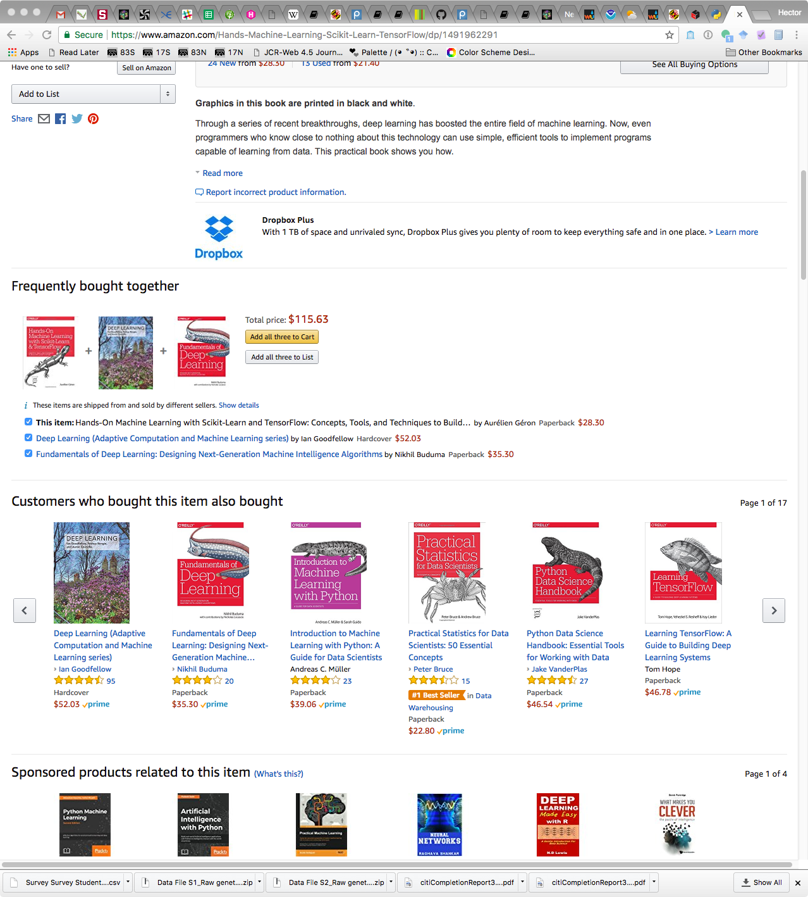
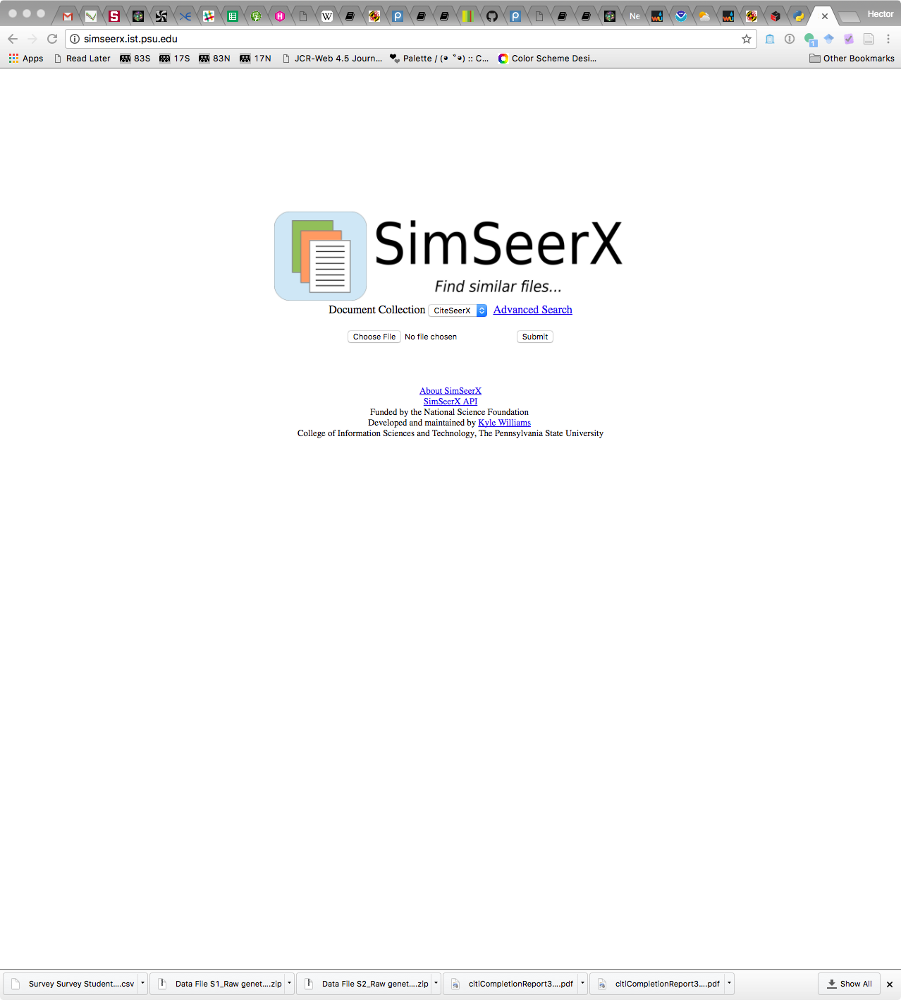

class: title-slide, center, middle
count: false

.banner[]

.title[Data Mining: Itemsets]

.author[Héctor Corrada Bravo]

.other-info[
University of Maryland, College Park, USA  
Fannie Mae: `r Sys.Date()`
]

.logo[]

---
class: split-50
exclude: true

## What does my group do?

.column[
Study the **molecular** basis of *variation* in development and disease


Using **high-throughput** experimental methods  
]

.column[.image-80[]]

---

## Data Mining

For today: the analysis of itemsets

- Similar itemsets
- Frequent itemsets

---
class: split-50

## Similar Itemsets

.column[

###Collaborative Filtering

- Items: customers
- Itemsets: customers that bought a specific book
- Similar itemsets: books purchased by same customers
]

.column[]

---
class: split-50

## Similar Itemsets

.column[
###Similar Documents

- Items: words
- Itemsets: documents
- Similar itemsets: documents using many of the same words
]

.column[]

---
class: split-50

## Similar Itemsets

.column[
###Similar News Articles

- Items: words
- Itemsets: news articles
- Similar itemsets: news articles usinbg many of the same words
]

.column[]

---
class: split-50

## Frequent Itemsets

.column[
###Online Purchasing

- Items: books
- Itemsets: orders (sets of books)
- Frequent itemsets: sets of books that are purchased together frequently
]

.column[]

---
## Similar Itemsets

- Describing set similarity (Jaccard Similarity)
- Representing documents as sets (Shingling)
- Similarity-preserving set summaries (Minhash)
- Search for similar itemsets using Locality-Sensitive Hashing (LSH)

---
class: split-50

## Jaccard Similarity

.column[
The _Jaccard Similarity_ of sets $S$ and $T$ is

$$\frac{S \bigcap T}{S \bigcup T}$$
]

.column[
.center[.image-50[]]
]

---

## Exercises

- Compute the Jaccard bag similarity of each pair of sets: $\{1,1,1,2\}$, $\{1,1,2,2,3\}$, $\{1,2,3,4\}$

- Suppose we have a universal set $U$ of $n$ elements. We chose two subsets $S$ and $T$, each with $m$ of the $n$ elements. What is the expected value of the JS of $S$ and $T$?

---

## Documents (Shingles)

- Set all words to lowercase, remove all whitespace and punctuation

`"Hurricane Irma, they confirmed landfall" ->`
`"hurricaneirmatheyconfirmedlandfall"`

--

- For some parameter $k$, represent document as the set of $k$-long subsequences of document

For k=3
`{hur,urr,rri,...,eir,irm,rma,...,fir,irm,rme,...}`

---

## Documents (Shingles)

- Choosing $k$: choose large enough that probability of any given shingle appearing in any given document is low. Depends on collection.

- Hashing: hash $k$-shingles instead of using them directly in algorithms that follow

- Using words, effective for similarity (more meaning) but sparser, set of possible shingles is huge

---

## Min-Hash

Clever idea: let's summarize item(sets) (.red[reduce data size!]) but make it easy to find similar item(sets).

---

## Min-Hash

Characteristic Matrix 

| Element | $S_1$ | $S_2$ | $S_3$ | $S_4$ |
|:-------:|:-----:|:-----:|:-----:|:-----:|
| $a$     | `1`   | `0`   | `0`   | `1`   |
| $b$     | `0`   | `0`   | `1`   | `0`   |
| $c$     | `0`   | `1`   | `0`   | `1`   |
| $d$     | `1`   | `0`   | `1`   | `1`   |
| $e$     | `0`   | `0`   | `1`   | `0`   |

---

## Min-Hash

- Permute the rows of the characteristic matrix
- Min-Hash value of set: first non-zero row in corresponding column

---

## Min-Hash

Permuted characteristic Matrix 

| Element | $S_1$ | $S_2$ | $S_3$ | $S_4$ |
|:-------:|:-----:|:-----:|:-----:|:-----:|
| $b$     | `0`   | `0`   | `1`   | `0`   |
| $e$     | `0`   | `0`   | `1`   | `0`   |
| $a$     | `1`   | `0`   | `0`   | `1`   |
| $d$     | `1`   | `0`   | `1`   | `1`   |
| $c$     | `0`   | `1`   | `0`   | `1`   |

--

$h(S_1)=a$, $h(S_2)=c$

---

## Min-Hash

Property: $Pr(h(S_i) = h(S_j)) = JS(S_i,S_j)$

Pf: on the board

---

## Min-Hash Signatures

- Choose $n$ permutations of rows, and set $h_i(S_j)$ as the Min-Hash given by permutation $i$ of set $j$

- Represent set $j$ by the _signature_ vector of Min-hashes $[h_1(S_j),\ldots,h_n(S_j)]$

- Collect signature vectors into a _signature matrix_ 

---

## Min-Hash Signatures in Practice

Instead of row permutations, use hash functions $h_i$ over row indices

Let $SIG(i,c)$ be the $i$th hash of $c$th element

 _Initialize_:  set $SIG(i,c)=\infty$ for all $i$ and $c$  
 _Row $r$_: 
 
 - Compute $h_i(r)$ for all $i$
 - For each column $c$:
  - If $c$ has a 0 in row $r$, do nothing
  - If $c$ has a 1 in row $r$, then for each $i=1,\ldots,n$:  
    set $SIG(i,c)$ to $\min(SIG(i,c),h_i(r))$
    
    
---

## Exercise

| Element | $S_1$ | $S_2$ | $S_3$ | $S_4$ |
|:-------:|:-----:|:-----:|:-----:|:-----:|
| $0$     | `0`   | `1`   | `0`   | `1`   |
| $1$     | `0`   | `1`   | `0`   | `0`   |
| $2$     | `1`   | `0`   | `0`   | `1`   |
| $3$     | `0`   | `0`   | `1`   | `0`   |
| $4$     | `0`   | `0`   | `1`   | `1`   |
| $5$     | `1`   | `0`   | `0`   | `0`   |

$h_1(x)=2x+1 \mod 6$ 
$h_2(x)=3x+2 \mod 6$  
$h_3(x)=5x+2 \mod 6$

---

## JS and Minhashing

Estimate $JS(S_i,S_j)$ as the proportion of rows (hashes) of the signature matrix that are equal for columns $S_i$ and $S_j$.

---

## Exercise

Prove that if the JS of two sets is 0, then Min-Hash always gives the right answer.

---

## Locality-Sensitive Hashing

Minhash gives a compressed representation of item(sets) that retains similarity

--

But to find all pairs of similar item(sets) can still take a lot of time

--

LSH gives us a way of only comparing likely similar pairs.  
Conversely, ignore pairs that are unlikely similar


---

## LSH for Minhash

- Divide signature matrix into $b$ bands, each with $r$ rows
- For each column (itemset) and band, hash it's $r$ entries according to some hash function
- Use same hash function in each of the bands, but use different hash arrays

--

Itemsets with similar signatures will hash to the same bucket with some likelihood (candidate similar pair)

--

Itemsets without matching signatures will not

---

## Analysis of LSH

Let $JS(S,T)=s$

- Probability signatures agree in all rows of one band: $s^r$
- Probability do not agree in at least one row of a band: $1-s^r$
- Probability that signatures do not agree in all rows of any of the bands: $(1-s^r)^b$
- Probability that signatures agree in all the rows of at least one band (hash to the same bucket at least once): $1-(1-s^r)^b$.

---

## Analysis of LSH

```{r echo=FALSE, fig.align="center"}
b <- 20
r <- 5

curve(1-(1-x^r)^b, from=0, to=1, xlab="similarity", ylab="candidate probability", lwd=2)
```


---

## Final algorithm for similar document search

Part I: Shingles

- Pick a value of $k$, construct $k$-shingles for each document (optionally hashing $k$-shingles)
- Sort documents by document-shingle pairs by shingle

---

## Final algorithm for similar document search

Part II: Minhash

- Pick a length $n$ for minhash signatures
- Compute minhash signatures for all documents

---

## Final algorithm for similar document search

Part III: LSH

- Choose threshold $t$ for how similar documents have to be to consider as a similar pair
- Choose number of bands $b$ and number of rows $r$ such that $br=n$ and threshold $t$ is approximately $(1/b)^(1/r)$
- Construct candidate pairs using LSH

---

## Final algorithm for similar document search

Part IV: Confirm similar pairs

- For each candidate pair, confirm that their signatures match in at least $t$ fraction of rows
- Optionally, verify similarity in shingled documents

---

## Frequent Itemsets

Find items that occur frequently together in sets

Examples: 

- items frequently bought together in the same transaction
- words that appear frequently together in the same document

---

## Market-Basket Model

Items: objects we are modeling
Baskets: sets of items (transactions)

Frequent itemsets: items that co-occur frequently in baskets

---

## Frequent Itemsets

Support: define the support of an itemset $I$ as the number of baskets in which itemset $I$ appears

Frequent itemsets: Itemsets $I$ with support at least some support threshold $s$

---

## Example

(1) {Cat, and, dog, bites}  
(2) {Yahoo, news, claims, a, cat, mated, with, a, dog, and, produced, viable, offspring}  
(3) {Cat, killer, likely, is, a, big, dog}  
(4) {Professional, free, advice, on, dog, training, puppy, training}  
(5) {Cat, and, kitten, training, and, behavior}  
(6) {Dog, &, Cat, provides, dog, training, in, Eugene, Oregon}  
(7) {"Dog, and, cat", is, a, slang, term, used, by, police, officers, for, a, male-female, relationship}  
(8) {Shop, for, your, show, dog, grooming, and, pet, supplies}

---

## Association Rules

Rules of the form `I -> j`: if itemset $I$ is in basket, then item $j$ is likely in basket as well

_rule confidence_: ratio of support of $I \bigcup \{j\}$ to support of $I$.

_rule interest_: difference between confidence of rule and fraction of baskets that contain $j$

---

## Association Rules

Note: once we have itemsets, we can get association rules easily

--

Suppose we find all frequent itemsets over some support threshold

Let itemset $J$ with $n$ items be one of those itemsets, then

1. there are only $n$ candidate Association Rules $J-\{j\}\rightarrow j$  
2. Both $J-\{j\}$ and $j$ are also frequent itemsets, so we have already calculated their support
3. We can quickly compute the _confidence_ and _interest_ of each rule

---

## Exercise

Suppose there are 100 items, numbered 1 to 100, and also 100 baskets, numbered 1 to 100.

Item $i$ is in basket $b$ iff $i$ divides $b$ with no remainder

- Item 1 is in all baskets, item 2 in the even-numbered baskets
- Basket 24 contains items {1,2,3,4,6,8,12,24}

a) If support threshold is 5, which items are frequent?
b) Which pairs are frequent?

---

## Itemset monotonicity

_If $I$ is a frequent itemset, then every subset of $I$ is a frequent itemset_

Why?

---

## The A-priori algorithm

Suppose we are given baskets over $n$ items

### First pass

Count the number of occurrences of each item (array of $n$ values)

### After first pass

Identify frequent singletons (above support threshold)

---

## The A-priori algorithm

### Second pass

Count the number of occurrences of pairs of frequent items

- For each basket:
  - Check which of its items are frequent (first pass)
  - For each pair of items increase occurrence count
  
### After the second pass

Identify frequent pairs (above support threshold)

---

## The A-priori algorithm

### Third pass

Count the number of occurrences of frequent pairs + a frequent item

- For each basket:
  - Check which item pairs and singletons that are frequent (first and second pass)
  - For each combination of pair and singleton, increase occurrence count
  
### After the third pass

Identify frequent triples (above support threshold)

---

## The A-priori algorithm

And so on until no more frequent sets are identified

_Notes:_

- The data structure to store pair counts will be important consideration
- The algorithm has a construct-filter structure: at each pass, _construct_ the set of candidate itemsets, _filter_ to those that are frequent

---

## Exercise

Apply A-priori algorithm to previous exercise

---

## Handling large datasets

For large datasets storing occurrences of candidate frequent pairs is problematic

PCY algorithm: hash item pairs and keep count in hash bucket

Define candidate frequent pairs as

- $i$ and $j$ anre frequent items
- $\{i,j\}$ hashes to a frequent bucket (with count > threshold)

---

## Handling large datasets

Identify frequent buckets with a bitmap (little memory)

Only count (and verify) candidate pairs as defined above (expected to be much fewer)

---

## Exercise

Consider baskets over items $1,\ldots,6$

$$
\\{1,2,3\\}\; \\{2,3,4\\}\; \\{3,4,5\\}\; \\{4,5,6\\} \\\\
\\{1,3,5\\}\; \\{2,4,6\\}\; \\{1,3,4\\}\; \\{2,4,5\\} \\\\
\\{3,5,6\\}\; \\{1,2,4\\}\; \\{2,3,5\\}\; \\{3,4,6\\}
$$

- Compute support for each item and each pair of items

- Using hash function $i \times j \mod 11$ (hash table with 11 buckets), which pairs hash to the same buckets?

---

## Exercise

- Which buckets are frequent?
- Which pairs are counted in the second pass of PCY algorithm?

---

## Summary

Itemset analysis: applications to collaborative filtering, recommendation engines

### Finding Similar Itemsets

- Jaccard similarity: measure of set similarity based on common items
- Minhashing with LSH: effective way of finding similar itemsets with efficient data structures for large datasets

---

## Summary

### Finding Frequent Itemsets

- Market-basket data: model of item transactions
- Frequent Itemsets: Sets of items appearing frequently in "baskets"
- Association Rules: $I \rightarrow j$
- Pair-counting Bottleneck: frequent itemset mining memory space taken mostly in keeping counts of pairs of frequent items
- Monotonicity of frequent itemsets
- A-priori Algorithm
- Hashing for large datasets
