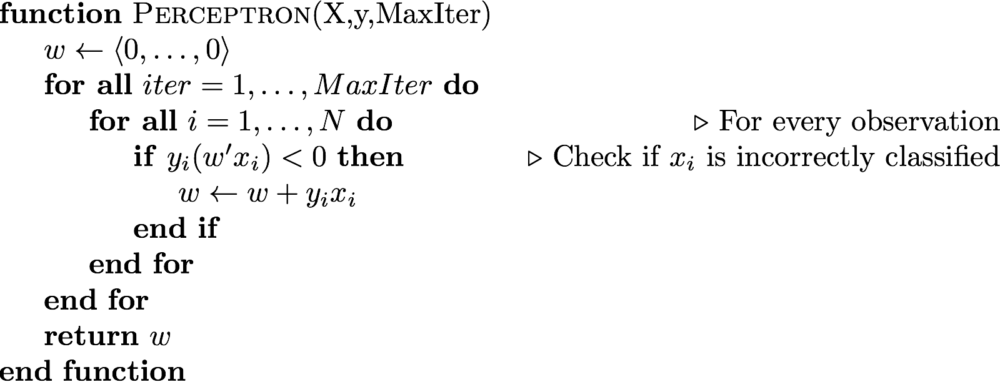

class: title-slide, center, middle
count: false

.banner[]

.title[Mathematical Background and the Perceptron]

.author[Héctor Corrada Bravo]

.other-info[
University of Maryland, College Park, USA  
CMSC643: `r Sys.Date()`
]

.logo[]

---
layout: true

## ML Preliminaries

---

A common situation in data analysis is that one has an outcome $Y$ and one or more independent covariates or predictors $X_1,\ldots,X_p$. 

One usually observes these variables for multiple "instances".  

--

(Note) We use upper case to denote a random variable. To denote actual numbers we use lower case. One way to think about it: $Y$ has not happened yet, and when it does, we see $Y=y$.

---

One may be interested in various things: 

- What effects do the covariates have on the outcome? 
- How well can we describe these effects? 
- Can we predict the outcome using the covariates?, etc...

---
class: split-60
layout: false

## Motivating Example: Credit Analysis

.column[
```{r, echo=FALSE, message=FALSE}
library(ISLR)
library(tidyverse)

data(Default)
Default %>%
  head() %>%
  knitr::kable(format="html")
```
]

.column[
Task: predict account default
What is the outcome $Y$?
What are the predictors $X_j$?
]

---

## Terminology and notation

We will be mixing the terminology of statistics and computer
science. 

For example, we will sometimes call $Y$ and $X$ the
outcome/predictors, sometimes observed/covariates, and even
input/output. We may call each instance an observation or example.

--

We will denote predictors with $X$ and outcomes with $Y$
(quantitative) and $G$ (qualitative). Notice $G$ are not numbers, so
we cannot add or multiply them.

---

# Terminology and notation

Height and weight are *quantitative measurements*. These are sometimes
called continuous measurements.

--

Gender is a *qualitative measurement*. They are also called
categorical or discrete. This is a particularly simple example because
there are only two values. With two values we sometimes call it
*binary*. 

---

# Terminology and notation

We will use $G$ to denote the set of possible
values. For gender it would be $G=\{Male,Female\}$. 

A special
case of qualitative variables are *ordered qualitative* where one can
impose an order. With men/women this can't be done, but with, say,
$G=\{low,medium,high\}$ it can.

---

## From data to feature vectors

The vast majority of ML algorithms we see in class treat instances as "feature vectors".

We can represent each instance as a _vector_ in Euclidean space $\langle x_1,\ldots,x_p,y \rangle$. 

--

This means:

- every measurement is represented as a continuous value
- in particular, categorical variables become numeric (e.g., one-hot encoding)

---

## From data to feature vectors

Here is the same credit data represented as a matrix of feature vectors

```{r, cache=TRUE, echo=FALSE}

default_mat <- Default %>%
  mutate(default=case_when(
    default == "Yes" ~ +1,
    TRUE ~ -1
  )) %>%  
  mutate(student=case_when(
    student == "Yes" ~ 1,
    TRUE ~ 0
  )) %>%
  as.matrix()

default_mat %>%
  as_data_frame() %>%
  group_by(default) %>%
  sample_n(3) %>%
  ungroup() %>%
  sample_frac(1.0) %>%
  knitr::kable(format="html")
```
---

# Technical notation

- Observed values will be denoted in lower case. So $x_i$
means the $i$th observation of the random variable $X$. 

- Matrices are
represented with bold face upper case. For example $\mathbf{X}$ will
represent all observed predictors. 

---

# Technical notation

- $N$ will usually mean the number of
observations, or length of $Y$. $i$ will be used to denote which
observation and $j$ to denote which covariate or predictor. 

- Vectors
will not be bold, for example $x_i$ may mean all predictors for
subject $i$, unless it is the vector of a particular predictor
$\mathbf{x}_j$. 

- All vectors are assumed to be column vectors, so the
$i$-th row of $\mathbf{X}$ will be $x_i'$, i.e., the transpose of
$x_i$.

---

## Geometry and Distances

Now that we think of instances as vectors we can do some interesting operations.

Let's try a first one: define a distance between two instances using Euclidean distance

$$d(x_1,x_2) = \sqrt{\sum_{j=1}^p(x_{1j}-x_{2j})^2}$$
---

## K-nearest neighbor classification

Now that we have a distance between instances we can create a classifier. Suppose we want to predict the class for an instance $x$. 

K-nearest neighbors uses the closest points in predictor space predict $Y$. 

$$
\hat{Y} = \frac{1}{k} \sum_{x_k \in N_k(x)} y_k.
$$

$N_k(x)$ represents the $k$-nearest points to $x$. How would you use $\hat{Y}$ to make a prediction?

---
layout: true

## K-nearest neighbors algorithm

---

.center[.image-100[]]

---

An important notion in ML and prediction is _inductive bias_.

What assumptions we make about our data that allow us to make predictions.

--

In KNN, our _inductive bias_ is that points that are **nearby** will be of the same class.

---

Parameter $K$ is a _hyper-parameter_, it's value may affect prediction accuracy significantly.

--

Question: which situation may lead to _overfitting_, high or low values of $K$? Why?

---
class: split-40

.column[
Feature scaling is an important issue in distance-based methods.

Which of these two features will affect distance the most?

We will see in later lectures how to address this.
]

.column[
```{r, echo=FALSE, message=FALSE, fig.width=4, fig.align="center"}
library(cowplot)

default_mat %>%
  as_data_frame() %>%
  ggplot(aes(x=student,y=balance,color=factor(default))) +
    geom_point() +
    coord_equal(ratio=1/1000)
```
]

---
layout: true

## Quick vector algebra review

---

- A (real-valued) vector is just an array of real values, for instance $x = \langle 1, 2.5, −6 \rangle$ is a three-dimensional
vector. 

- Vector sums are computed pointwise, and are only defined when dimensions match, so 

$$\langle 1, 2.5, −6 \rangle + \langle 2, −2.5, 3 \rangle =  \langle 3, 0, −3 \rangle$$.

---

In general, if $c = a + b$ then $cd = ad + bd$
for all vectors $d$. 

Vector addition can
be viewed geometrically as taking a vector $a$, then tacking on $b$ to the end of it; the new end point is
exactly $c$.

.center[.image-20[]]
---

_Scalar Multiplication_: vectors can be scaled by real values; 

$$2\langle 1, 2.5, −6 \rangle = \langle 2, 5, −12\rangle$$

In general, $ax = \langle ax_1, ax_2, \ldots, ax_p\rangle$

---

The norm of a vector $x$, written $\|x\|$ is its length. 

Unless otherwise specified, this is its Euclidean length,
namely: 

$$\|x\| = \sqrt{\sum_{j=1}^p x_j^2}$$

---

### Quiz 

Write Euclidean distance of vectors $u$ and $v$ as a vector norm

---

The _dot product_, or _inner product_ of two vectors $u$ and $v$ is defined as

$$u'v = \sum_{j=1}^p u_i v_i$$

--

A useful geometric interpretation of the inner product $v'u$ is that it gives the projection of $v$ onto $u$ (when $\|u\|=1$).

.center[.image-20[]]

---
layout: true

## Back to KNN classification

---

The algorithm we saw scans the complete training set $X$ to make a prediction for observation $x$.

This is not a good idea when the training set is massive.

---


Suppose I give you function `hash_vector` that does the following:

- Generate random unit vector $u$, $\|u\|=1$
- Given vector $x$, compute $a=x'u$
- Round $a$ to the nearest integer

--

### Quiz

Sketch a system that uses locality sensitive hashing (LSH) with `hash_vector` to find candidate near neighbors of $x$ to avoid computing distance to all vectors in dataset $X$.

---
layout: true

## The curse of dimensionality

---

Distance-based methods like KNN can be problematic in high-dimensional problems

---

Consider the case where we have many covariates. We want to use $k$-nearest neighbor methods.  

--

Basically, we need to define distance and  look for small
multi-dimensional "balls"
around the target points. With many covariates this becomes
difficult. 

---


Imagine we have equally spaced data and that each
covariate is in $[0,1]$. We want to something like kNN with a local focus
that uses
10% of the data in the local fitting. 

--

If we have 
$p$ covariates and we are forming $p$-dimensional cubes, then each
side of the cube must have size $l$ determined by $l \times l \times \dots \times l = l^p = .10$. 

---

If the number of covariates is p=10, then $l = .1^{1/10} = .8$. So it
really isn't local! If we reduce the percent of data we consider to
1%, $l=0.63$. Still not very local.  

--

If we keep reducing the size of the 
neighborhoods  we will end up with very small number
of data points in each average and thus predictions with very large variance.

---

This is known as *the curse of dimensionality*.

Because of this so-called curse, it is not always possible to use KNN. But other methods, like Decision Trees, thrive on
multidimensional data. 

---
layout: true

## Geometric Representation of Classification Problems
---


Recall that our setting is that we observe for subject $i$ predictors (covariates)
$x_i$, and *qualitative* outcomes (or classes) $g_i$, which can takes
values from a discrete set $G$.

--

Since our prediction $\hat{G}(x)$ will always take values in the
discrete set $G$, we can always divide the input space into a
collection of regions taking the same predicted values.

---
class: split-50


.column[
Boundaries can be smooth or rough depending
on the prediction function. 
]

.column[]

---


For an important class of procedures, these *decision boundaries* are
linear. 

This is what we will refer to as linear methods for
classification. 


---
exclude: true

## Separating hyperplanes

So far we have seen methods that use a probabilistic argument to
estimate parameters. 

For example, in LDA we assume the class conditional density
is Gaussian and find maximum likelihood estimates. 

In logistic regression, we find Maximum Likelihood Estimators to the Binomial model.

---
class: split-50


.column[
The _perceptron algorithm_ is a way of finding discriminant functions that are *linear* with respect to the
covariates $X_1,\ldots,X_p$. 
]

.column[]

---

In $p$-dimensional space $\mathbf{R}^p$ these are described by vectors
$w$. The *decision boundary* is thus

$$L=\{x:w'x = 0\}.$$

---

Notice that this boundary partitions the input space into two sets on
each side of the line. 

If we restrict estimates to those for which
$\\|w\|=1$ 

Then the *signed* distance of any point
$x$ to the decision boundary $L$ is $w'x$. 

---

With this we can easily
describe the two partitions as

$$\begin{aligned}
L^+ & =\{x:w'x>0\}, \\\\
L^{-} & =\{x:w'x<0\}
\end{aligned}$$

---

Intuitively, the $w$ we want as an estimate is one that separates
the training data as perfectly as possible. 

If we code our classes as
$y=-1$ if $g=1$ and $y=+1$ if $g=2$, we can describe our intuitive
requirement for estimate $w$ as: 

$$
y_i(w'x_i) > 0, i=1,\ldots,N
$$


---
layout: true

## Perceptron Algorithm

---

The _Perceptron_ algorithm is one way of finding a vector $w$ that
satisfies the separation requirement as much as possible. 
---

Penalize $w$ by how far into the wrong side misclassified
points are:

$$D(w) = - \sum_{i\in \mathcal{M}} y_i (w'x_i)$$

$\mathcal{M}$: set of points misclassified  by $w$ (on the wrong side of the hyper-plane).

---

The perceptron algorithm estimates $w$ by _minimizing_ $D$. 
--

We'll see details how next class, but this introduces an important point:

We will write down learning algorithms as _optimization problems_ where we _minimize_ some _cost function_ determined by prediction error.

---


---

Why does this work?

### Quiz

Show that if $y_i(w'x_i)<0$ then after updating $w$, $w'x_i$ is changed in the proper direction. That is, it is made larger if $y_i=+1$ and made smaller if $y_i=-1$.

---

### Some Notes

- `MaxIter` is a hyper-parameter.
- You can interpret the size of $w_j$ as the _importance_ of feature $j$ for classification

---

There are a few problems with this algorithm:

If there exists $w$ that separates the training points perfectly, 

--

then there are an infinite number of $w$s that also separate the data perfectly

---

Algorithm will converge in a finite number of steps if the training data is separable 

--

However, the number of finite steps can be *very* large (see CIML for a bound on the number of steps)

---

When the training data is *not* separable, the algorithm will not converge.

---

## Summary

- We will represent many ML algorithms geometrically as vectors

- Vector math review

- K-nearest neighbors and perceptron algorithms
