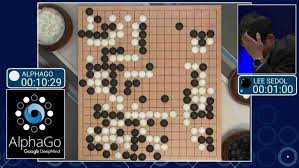
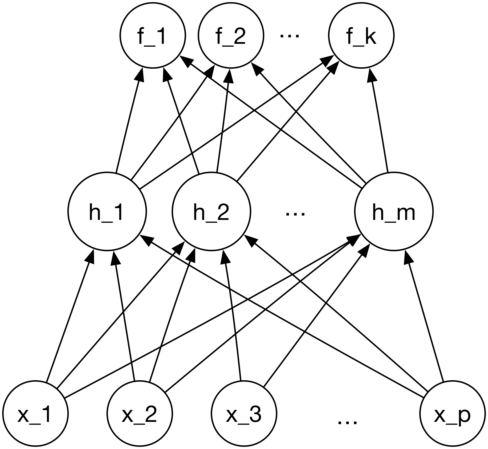
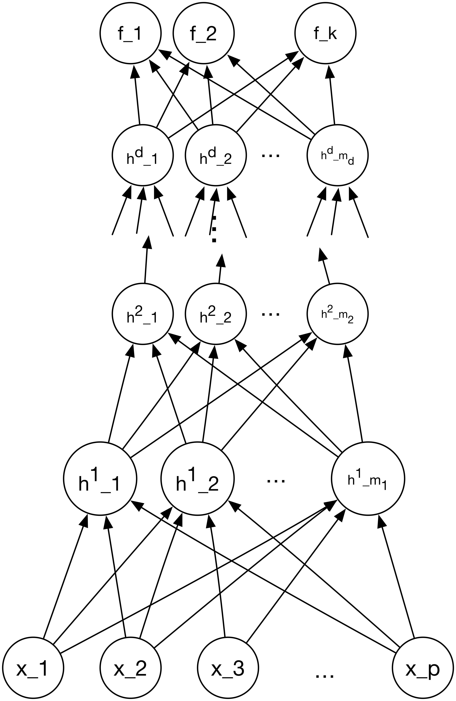
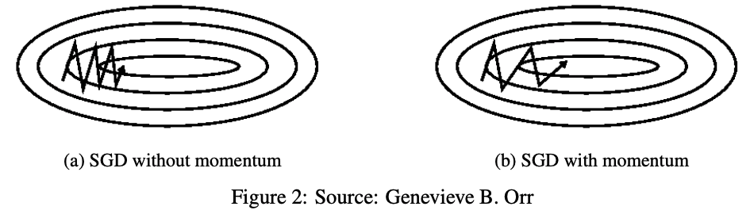
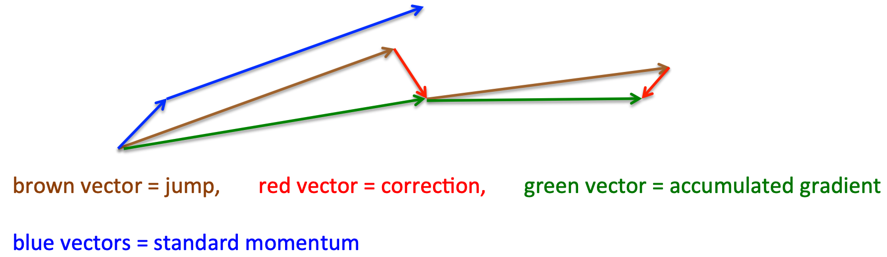

class: title-slide, center, middle
count: false

.banner[]

.title[Modern Gradient Descent]

.author[Héctor Corrada Bravo]

.other-info[
University of Maryland, College Park, USA  
CMSC 644: `r Sys.Date()`
]

.logo[]

---
class: split-50
exclude: true

## What does my group do?

.column[
Study the **molecular** basis of *variation* in development and disease


Using **high-throughput** experimental methods  
]

.column[.image-80[]]

---
class: split-50

## Historical Overview

.column[
Neural networks are a decades old area of study. 

Initially, these computational models were created with the goal of mimicking the processing of neuronal networks. 
]

.column[
.image-50[]
]

---
class: split-50

## Historical Overview

.column[
Inspiration: model neuron as processing unit.

Some of the mathematical functions historically used in neural network models arise from biologically plausible activation functions.
]

.column[
.image-50[]
]

---
class: split-50

## Historical Overview

.column[
Somewhat limited success in modeling neuronal processing 

Neural network models gained traction as general Machine Learning models. 
]

.column[
.image-50[]
]

---

## Historical Overview

Strong results about the ability of these models to approximate arbitrary functions 

Became the subject of intense study in ML. 

In practice, effective training of these models was both technically and computationally difficult.

---
class: split-50

## Historical Overview

.column[
Starting from 2005, technical advances have led to a resurgence of interest in neural networks, specifically in _Deep Neural Networks_. 
]

.column[
.image-50[]
]

---

## Deep Learning

Advances in computational processing: 
  - powerful parallel processing given by Graphical Processing Units

--

Advances in neural network architecture design and network optimization 

--

Researchers apply Deep Neural Networks successfully in a number of applications. 

---
class: split-50

## Deep Learning

.column[
Self driving cars make use of Deep Learning models for sensor processing. 
]

.column[
.image-50[.center[]]
]

---
class: split-50

## Deep Learning

.column[
Image recognition software uses Deep Learning to identify individuals within photos. 
]

.column[
.image-50[]
]

---
class: split-50

## Deep Learning

.column[
Deep Learning models have been applied to medical imaging to yield expert-level prognosis. 
]

.column[
.image-50[]
]

---
class: split-50

## Deep Learning


.column[
An automated Go player, making heavy use of Deep Learning, is capable of beating the best human Go players in the world.
]

.column[
.image-50[]
]

---

## Feed-forward Neural Networks

We will present the feed-forward neural network formulation for a general case where we are modeling $K$ outcomes $Y_1,\ldots,Y_k$ as $f_1(X),\ldots,f_K(X)$. 

---

## Feed-forward Neural Networks

In multi-class classification, categorical outcome may take multiple values

We consider $Y_k$ as a discriminant function for class $k$, 

Final classification is made using $\arg \max_k Y_k$. For regression, we can take $K=1$.

---

## Feed-forward Neural Networks

A single layer feed-forward neural network is defined as

$$h_m = g_h(\mathbf{w}_{1m}'X), \; m=1,\ldots,M \\\
f_k = g_{fk}(\mathbf{w}_{2k}'\mathbf{h}),\; k=1,\ldots,K$$

---
class: split-50

## Feed-forward Neural Networks


.column[
```{r, echo=FALSE, out.width="100%"}

```
]

.column[The network is organized into _input_, _hidden_ and _output_ layers. ]

---
class: split-50

## Feed-forward Neural Networks


.column[
```{r, echo=FALSE, out.width="100%"}

```
]

.column[
Units $h_m$ represent a _hidden layer_, which we can interpret as a 
_derived_ non-linear representation of the input data as we saw before. 
]

---
class: split-50

## Feed-forward Neural Networks


.column[
```{r, echo=FALSE, out.width="100%"}

```
]

Function $g_h$ is an _activation_ function used to introduce non-linearity to the representation. 

---
class: split-30

## Feed-forward Neural Networks


.column[Historically, the sigmoid activation function was commonly used $g_h(v)=\frac{1}{1+e^{-v}}$ or the hyperbolic tangent. 
]

.column[
```{r activation, echo=FALSE}
curve(pmax(0,x), from=-1,to=1, 
      xlab=expression(z),ylab=expression(g[h](z)), 
      col="red",lwd=1.9,ylim=c(-1,1))
curve(1/(1+exp(-4*x)), add=TRUE, col="blue", lwd=1.9)
curve(tanh(x), add=TRUE, col="black", lwd=1.9)
legend("topleft",
       legend=c("ReLU","sigmoid","tanh"),
       lty=1,lwd=1.9,col=c("red","blue","black"))
```
]

---
class: split-30

## Feed-forward Neural Networks


.column[ 
Nowadays, a rectified linear unit (ReLU) $g_h(v)=\max\{0,v\}$ is used more frequently in practice. (there are many extensions)
]

.column[
```{r activation2, echo=FALSE}
curve(pmax(0,x), from=-1,to=1, 
      xlab=expression(z),ylab=expression(g[h](z)), 
      col="red",lwd=1.9,ylim=c(-1,1))
curve(1/(1+exp(-4*x)), add=TRUE, col="blue", lwd=1.9)
curve(tanh(x), add=TRUE, col="black", lwd=1.9)
legend("topleft",
       legend=c("ReLU","sigmoid","tanh"),
       lty=1,lwd=1.9,col=c("red","blue","black"))
```
]

---
class: split-50

## Feed-forward Neural Networks


.column[
```{r, echo=FALSE, out.width="100%"}

```
]

.column[
Function $g_f$ used in the output layer depends on the outcome modeled. 

For classification a _soft-max_ function can be used $g_{fk}(t_k) = \frac{e^{t_k}}{\sum_{l=1}^K e^{t_k}}$ where $t_k=\mathbf{w}_{2k}'\mathbf{h}$. 

For regression, we may take $g_{fk}$ to be the identify function.
]

---
exclude: true

## Feed-forward Neural Networks


The single-layer feed-forward neural network has the same parameterization as the PPR model, 

Activation functions $g_h$ are much simpler, as opposed to, e.g., smoothing splines as used in PPR.

---

layout: true
class: split-50

## Deep Feed-Forward Neural Networks

.column[
.center[.image-60[]]
]

---

.column[
The general form of feed-forward network can be extended by adding additional _hidden layers_.
]

---

.column[
Empirically, it is found that by using more, thinner, layers, better expected prediction error is obtained.

However, each layer introduces more non-linearity into the network.

Making optimization markedly more difficult.
]

---

.column[
We may interpret hidden layers as progressive derived representations of the input data.

Since we train based on a loss-function, these derived representations should make modeling the outcome of interest progressively easier.
]

---

.column[
In many applications, these derived representations are used for model interpretation.
]

---
layout: true

## Stochastic Gradient Descent

---

Other learning methods we have seen, like mixture models and SVMs are **optimization problems** 

We can design gradient-descent based optimization algorithms that process  data efficiently.

We will use linear regression as a case study of how this insight would work.

---
layout: true

### Case Study

---

Let's use linear regression with one predictor, no intercept as a case study.

**Given**: Training set $\{(x_1, y_1), \ldots, (x_n, y_n)\}$, with continuous response $y_i$ and single predictor $x_i$ for the $i$-th observation.

**Do**: Estimate parameter $w$ in model $y=wx$ to solve

$$\min_{w} L(w) = \frac{1}{2} \sum_{i=1}^n (y_i - w x_i)^2$$

---
class: split-50

.column[Suppose we want to fit this model to the following (simulated) data:]

.column[
```{r, echo=FALSE}
set.seed(1234)
true_beta <- 5
x <- runif(100, -10, 10)
y <- x * true_beta + rnorm(100, mean=0, sd=sqrt(10))
plot(x,y,pch=19,cex=1.4,main="Simulated Data", cex.lab=1.5, cex.main=2)
abline(a=0, b=true_beta, col="red", lwd= 2)
```
]

---
class: split-50

.column[Our goal is then to find the value of $w$ that minimizes mean squared error. This corresponds to finding one of these many possible lines.]

.column[
```{r, echo=FALSE, fig.height=15, fig.width=15}
plot(x,y,pch=19,cex=1.4,main="Simulated Data", cex.lab=1.5, cex.main=2)
abline(a=0, b=true_beta, col="red", lwd= 2)
for (b in seq(-6,6, len=5)) {
  abline(a=0,b=b,col="blue", lwd=2, lty=2)
}
legend("bottom", legend=paste("w=", seq(-6,6,len=5)), lwd=2, lty=2, cex=1.5)
```
]

---
class: split-50

.column[Each of which has a specific error for this dataset:]


.column[
```{r, echo=FALSE, fig.height=12, fig.width=15}
n <- length(y)
compute_loss <- function(beta, x, y) {
  0.5 * mean((y-x*beta)^2)
}
beta <- seq(-20, 20, len=100)
plot(beta, sapply(beta, compute_loss, x=x, y=y), type="l", lwd=2, ylab=expression(L(w)),cex.lab=1.5,xlab=expression(w))
abline(v=true_beta, col="red", lwd=2)
abline(v=seq(-6,6,len=5), col="blue", lwd=2, lty=2)
```
]

---

Insights:

1) As we saw before in class, loss is minimized when the derivative of the loss function is 0

2) and, the derivative of the loss (with respect to $w$ ) at a given estimate $w$ suggests new values of $w$ with smaller loss!

---
class: split-40

.column[Let's take a look at the derivative:

$$\frac{\partial}{\partial w} L(w) = \\
\frac{\partial}{\partial w} \frac{1}{2} \sum_{i=1}^n (y_i - w x_i)^2 \\
{} = \sum_{i=1}^n (y_i - w x_i) (-x_i)$$


]


.column[
```{r, echo=FALSE, fig.width=5, cache=FALSE, fig.align="center"}
loss_derivative <- function(beta, x, y) {
  f <- beta * x
  resid <- y - f
  sum(resid * (-x))
}

plot(beta, sapply(beta, loss_derivative, x=x, y=y), type="l", lwd=1.5, xlab=expression(w), ylab=expression(partialdiff * L(w) / partialdiff * w),cex.lab=1.7)

abline(v=true_beta, col="red", lwd=2)
abline(v=seq(-6,6,len=5), col="blue", lwd=2, lty=2)
abline(h=0, col="black", lwd=2, lty=2)
```
]

---
layout: true

## Gradient Descent

---

This is what motivates the Gradient Descent algorithm

1. Initialize $w=\mathrm{normal(0,1)}$
2. Repeat until convergence
  - Set $w = w + \eta \sum_{i=1}^n (y_i - f(x_i)) x_i$
  

---

The basic idea is to move the current estimate of $w$ in the direction that minimizes loss the *fastest*. 

---
class: split-50

.column[Let's run GD and track what it does:]

.column[
```{r, echo=FALSE}
# Implementation of gradient descent for least squares regression
# for a single predictor (x)
#
# There is some code here that is only used to generate illustrative plots and would not be part of real solver
gradient_descent <- function(x, y, tol=1e-6, maxit=50, plot=FALSE) {
  # initialize estimate
  beta_1 <- 0; old_beta_1 <- Inf; i <- 0; beta_keep <- NA
  beta_trace <- beta_1
  
  # compute loss at first estimate
  loss <- compute_loss(beta_1, x, y); loss_keep <- NA
  loss_trace <- loss
  
  # starting step size
  alpha <- 1e-3
  difference <- Inf
  
  # check for convergence
  # (in practice, we do include a limit on the number of iterations)
  while ((difference > tol) && (i < maxit)) {
    cat("it: ", i, " beta: ", round(beta_1, 2), "loss: ", round(loss, 2), " alpha: ", round(alpha, 6), "\n")
    
    # this piece of code just adds steps to an existing plot
    if (plot && !is.na(beta_keep) && !is.na(loss_keep)) {
      #suppressWarnings(arrows(beta_keep, loss_keep, beta_1, loss, lty=2, col="blue"))
      beta_trace <- c(beta_trace, beta_1)
      loss_trace <- c(loss_trace, loss)
    }
    
    # store the last estimate for plotting
    beta_keep <- beta_1; loss_keep <- loss;
    
    # store the last estimate to check convergence
    old_beta_1 <- beta_1
    
    # update estimate
    f <- beta_1 * x
    resid <- y - f    
    beta_1 <- beta_1 + alpha * sum(resid * x)
    
    # compute difference after taking step
    # to check convergence
    difference <- (beta_1 - old_beta_1)^2 / (old_beta_1)^2
  
    # compute loss and derivative for updated estimate
    loss <- compute_loss(beta_1, x, y)

    i <- i+1
    
    # shorten the step size
    if ((i %% 3) == 0) alpha <- alpha / 2
  }
  if (plot) {
    #suppressWarnings(arrows(beta_keep, loss_keep, beta_1, loss, lty=2, col="blue"))
    beta_trace <- c(beta_trace, beta_1)
    loss_trace <- c(loss_trace, loss)
    return(list(beta_1, beta_trace, loss_trace))
  }
  beta_1
}
```

```{r, echo=FALSE, cache=TRUE, results='hide'}
res <- gradient_descent(x, y, plot=TRUE)
```

```{r, echo=FALSE, warning=FALSE, cache=TRUE, animation.hook='gifski'}
yloss <- sapply(beta, compute_loss, x=x, y=y)
beta_trace <- res[[2]]
loss_trace <- res[[3]]

plot_trace <- function(beta, yloss, beta_trace, loss_trace) {
  narrows <- length(beta_trace)

  for (i in seq(2,narrows)) {
    plot(beta, yloss, type="l", lwd=2, ylab=expression(L(w)),cex.lab=1.5,xlab=expression(w), xlim=c(-20,20),
     main="Gradient Descent")
  
    suppressWarnings(arrows(beta_trace[1:(i-1)], loss_trace[1:(i-1)], beta_trace[2:i], loss_trace[2:i], lty=2, col="blue"))
  }
}

plot_trace(beta, yloss, beta_trace, loss_trace)
```
]

---

"Batch" gradient descent: take a step (update $w$) by calculating derivative with respect to _all_ $n$ observations in our dataset. 


$$w = w + \eta \sum_{i=1}^n (y_i - f(x_i, w)) x_i$$

where $f(x_i) = w x_i$.

---

For multiple predictors (e.g., adding an intercept), this generalizes to the _gradient_ 


$$
\mathbf{w} = \mathbf{w} + \eta \sum_{i=1}^n (y_i - f(\mathbf{x}_i, \mathbf{w})) \mathbf{x}_i
$$

where $f(\mathbf{x}_i, \mathbf{w}) = w_0 + w_1 x_{i1} + \cdots + w_p x_{ip}$

---

Gradiest descent falls within a family of optimization methods called _first-order methods_ (first-order means they use derivatives only). These methods have properties amenable to use with very large datasets:

1. Inexpensive updates    
2. "Stochastic" version can converge with few sweeps of the data  
3. "Stochastic" version easily extended to streams  
4. Easily parallelizable  

Drawback: Can take many steps before converging

---
layout: true

## Stochastic Gradient Descent

---

**Key Idea**: Update parameters using update equation _one observation at a time_:

1. Initialize $\beta=\mathrm{normal}(0,\sqrt{p})$, $i=1$
2. Repeat until convergence
  - For $i=1$ to $n$
    - Set $w = w + \eta (y_i - f(\mathbf{x}_i, \mathbf{w})) \mathbf{x}_i$

---
class: split-50

```{r, echo=FALSE}
# Implementation of stochastic gradient descent for least squares regression
# for a single predictor (x)
#
# There is some code here that is only used to generate illustrative plots
stochastic_gradient_descent <- function(x, y, tol=1e-6, maxit=50, plot=FALSE) {
  n <- length(y)
  
  # initialize estimate
  beta_1 <- 0; i <- 0; beta_keep <- NA
  beta_trace <- beta_1
  
  # compute loss at first estimate
  loss <- compute_loss(beta_1, x, y); loss_keep <- NA
  loss_trace <- loss
  
  # initial step size
  alpha <- 1e-3
  difference <- Inf
  
  # check for convergence
  # (in practice a max number of iterations is used)
  while ((difference > tol) && (i < maxit)) {
    cat("it: ", i, " beta: ", round(beta_1, 2), "loss: ", round(loss, 2), " alpha: ", round(alpha, 6), "\n")
    
    # store last estimate to check convergence
    old_beta_1 <- beta_1
    
    # iterate over observations
    for (j in seq(1,n)) {
      
      # add step to plot
      if (plot && !is.na(beta_keep) && !is.na(loss_keep)) {
        #suppressWarnings(arrows(beta_keep, loss_keep, beta_1, loss, lty=2, col="blue"))
        beta_trace <- c(beta_trace, beta_1)
        loss_trace <- c(loss_trace, loss)
      }
      
      # store last estimate and loss for plotting
      beta_keep <- beta_1; loss_keep <- loss;
      
      # update estimate with j-th observation
      f <- beta_1 * x[j]
      resid <- y[j] - f      
      beta_1 <- beta_1 + alpha * resid * x[j]
      
      # compute loss with new estimate
      loss <- compute_loss(beta_1, x, y)
    }
    
    # check difference between current and old estimate
    # to check convergence
    difference <- (beta_1 - old_beta_1)^2 / old_beta_1^2
    i <- i+1
    
    # update step size
    if ((i %% 5) == 0) alpha <- alpha / 2
  }
  
  if (plot) {
    #suppressWarnings(arrows(beta_keep, loss_keep, beta_1, loss, lty=2, col="blue"))
    beta_trace <- c(beta_trace, beta_1)
    loss_trace <- c(loss_trace, loss)
    return(list(beta_1,beta_trace,loss_trace))
  }
  
  beta_1
}
```


.column[Let's run this and see what it does:]

.column[

```{r, echo=FALSE, cache=TRUE, results='hide'}
res2 <- stochastic_gradient_descent(x, y, plot=TRUE)
```

```{r, echo=FALSE, warning=FALSE, cache=TRUE, animation.hook='gifski'}
yloss <- sapply(beta, compute_loss, x=x, y=y)
beta_trace <- res2[[2]]
loss_trace <- res2[[3]]

plot_trace(beta, yloss, beta_trace, loss_trace)
```
]

---
Why does SGD make sense?

For many problems we are minimizing a cost function of the type

$$
\arg \min_f \frac{1}{n} \sum_i L(y_i,f_i) + \lambda R(f)
$$
Which in general has gradient

$$
\frac{1}{n} \sum_i \nabla_f L(y_i,f_i) + \lambda \nabla_f R(f)
$$

---

$$
\frac{1}{n} \sum_i \nabla_f L(y_i,f_i) + \lambda \nabla_f R(f)
$$

The first term looks like an empirical estimate (average) of the gradient at $f_i$

SGD then uses updates provided by a different _estimate_ of the gradient based on a single point.

- Cheaper
- Potentially unstable

---

In practice

- Mini-batches: use ~100 or so examples at a time to estimate gradients
- Shuffle data order every pass (epoch)

---

This still presents challenges:

- Choosing proper learning rate
- How to update learning rate as iterations increase
- Per-parameter learning rates 
- Avoiding local minima

--

We will see modern derivatives of SGD that can address some of these challenges

---
layout: false
class: split-40

## Momentum

.column[
Avoid short-step oscillation in SGD by incorporating previous step information

SGD:

$$
w = w - \eta \nabla_w L(y,w)
$$
]

.column[
.image-60[]
]

---
layout: false
class: split-40

## Momentum

.column[
Avoid short-step oscillation in SGD by incorporating previous step information

SGD w/ momentum:

$$
\begin{array}
{} & v_t = \gamma v_{t-1} + \eta \nabla_w L(y,w) \\
{} & w  =  w - v_t
\end{array}
$$
]

.column[
.image-60[]
]

---

## Accelerated Momentum

.center.image-80[]

$$
\begin{array}
{} & v_t = \gamma v_{t-1} + \eta \nabla_w L(y,w-\gamma v_{t-1}) \\
{} & w  =  w - v_t
\end{array}
$$
---
 
## Adaptive Moment Estimation (Adam)
 
Computes adaptive learning rates for each parameter in model
 
Updates based on exponentially decaying average of past squared gradients (for adaptation)

$$v_t = \beta_2 v_{t-1} + (1-\beta_2) (\nabla_w L(y,w))^2$$

--

And past gradients (for momentum)

$$m_t = \beta_1 m_{t-1} + (1-\beta_1) \nabla_w L(y,w)$$

---
class: split-50

## Adaptive Moment Estimation (Adam)

.column[
$$
w = w - \frac{\eta}{\sqrt{v_t} + \epsilon}m_t
$$
]

.column[
.image-40[]
]

---
layout: false

## Summary

- Improved stablilty by exploiting 'estimation' interpretation of gradient descent

- Stabilize by aggregating estimates of gradients

- Scaling by variance of estimates

- Intepretation of algoritms in terms of estimators can greatly improve performance
