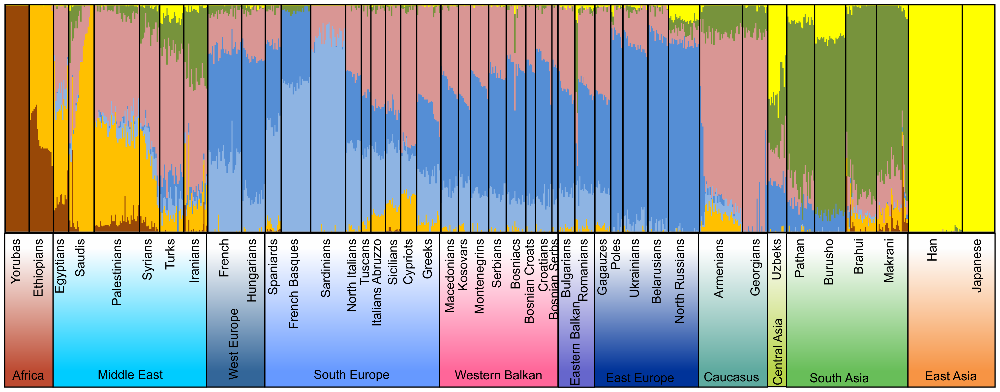
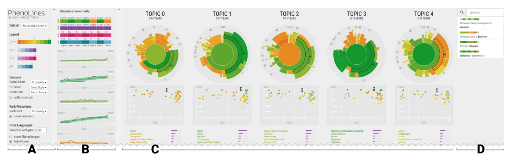
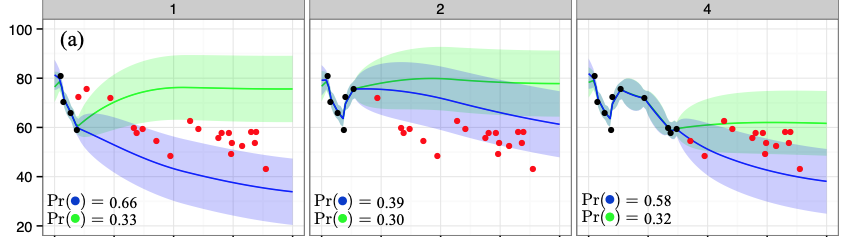
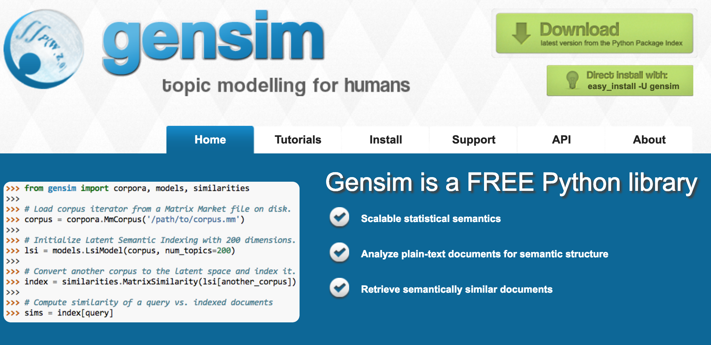
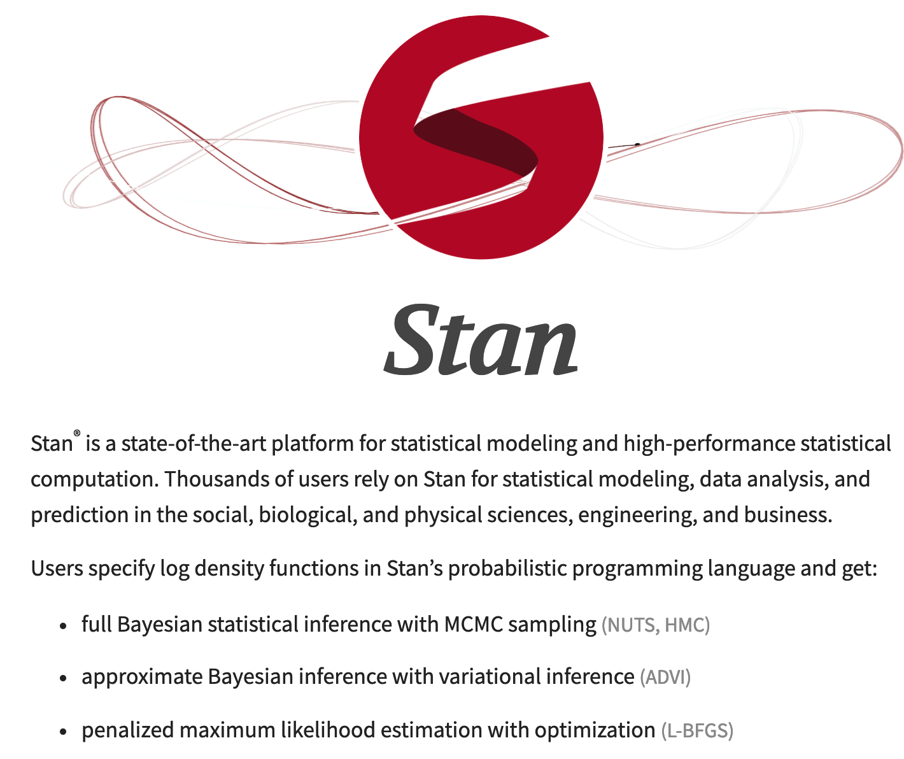
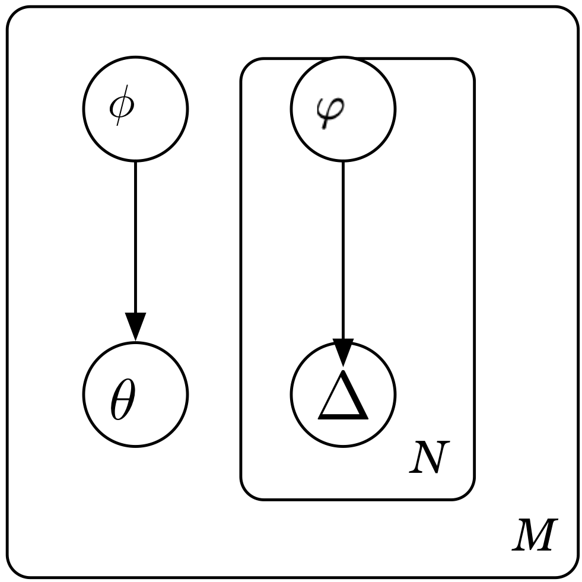
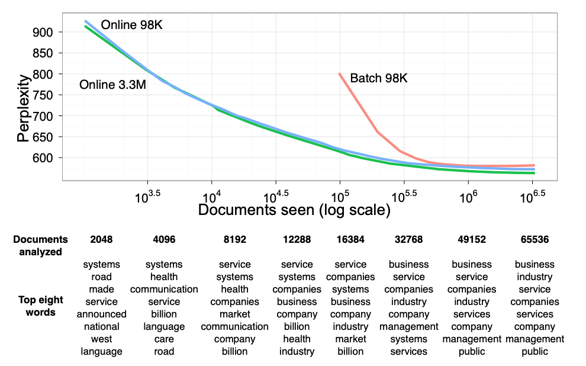

class: title-slide, center, middle
count: false

```{r cowplot_setup, echo=FALSE, message=FALSE}
library(cowplot)
```

.banner[]

.title[Gibbs Sampling and Variational Methods]

.author[Héctor Corrada Bravo]

.other-info[
University of Maryland, College Park, USA  
CMSC 644: `r Sys.Date()`
]

.logo[]

---
layout: true

## Mixture Models

---

Documents as _mixtures_ of topics (Hoffman 1999, Blei et al. 2003) 

```{r, echo=FALSE, out.width='70%'}
knitr::include_graphics("img/plsa.png")
```

.source[Blei (2012), Comm. ACM]

---

More applications: genetics, populations as mixture of ancestral populations

```{r, echo=FALSE, out.width='80%'}

```

.source[Kovacevic (2014), PLOS One]

---

More applications: clinical subtyping

```{r, echo=FALSE, out.width='100%'}

```

.source[Glueck, et al. (2017). TVCG]

---

More applications: clinical prognosis

```{r, echo=FALSE, out.width='90%'}

```

.source[Schulman and Saria (2016). JMLR]

---

### Software

```{r, echo=FALSE, out.width='70%'}

```

.source[https://radimrehurek.com/gensim/]

---

### Software

```{r, echo=FALSE, out.width='40%',fig.align='center'}

```

.source[https://mc-stan.org/]

---
Notation:

We have a set of documents $D$

Each document modeled as a bag-of-words (bow) over dictionary $W$.

$x_{w,d}$: the number of times word $w \in W$ appears in document $d \in D$.

---
layout: true

## Approximate Inference by Sampling

---

Ultimately, what we are interested in is learning topics

Perhaps instead of finding parameters $\theta$ that maximize likelihood 

Sample from a distribution $Pr(\theta | D)$ that gives us topic estimates

--

But, we only have talked about $Pr(D|\theta)$ how can we sample parameters?

---

Like EM, the trick here is to expand model with _latent_ data $Z^m$

And sample from distribution $Pr(\theta,Z^m|Z)$

--

This is challenging, but sampling from $Pr(\theta|Z^m,Z)$ and $Pr(Z^m|\theta,Z)$ is easier

---

The _Gibbs Sampler_ does exactly that

_Property_: After some rounds, samples from the conditional distributions $Pr(\theta|Z^m,Z)$ 

Correspond to samples from 
marginal $Pr(\theta|Z) = \sum_{Z^m} Pr(\theta,Z^m|Z)$

---

Quick aside, how to simulate data for pLSA?

- Generate parameters $\{p_d\}$ and $\{\theta_t\}$
- Generate $\Delta_{w,d,t}$

---

Let's go backwards, let's deal with $\Delta_{w,d,t}$

--

$$\Delta_{w,d,t} \sim \mathrm{Mult_{x_{w,d}}}(\gamma_{w,d,1},\ldots,\gamma_{w,d,T})$$

Where $\gamma_{w,d,t}$ was as given by E-step

--

```python
for d in range(num_docs):
  delta[d,w,:] = np.random.multinomial(doc_mat[d,w],
      gamma[d,w,:])
```

---

Hmm, that's a problem since we need $x_{w,d}$...

But, we know $Pr(w,d)=\sum_t p_{t,d}\theta_{w,t}$ so, let's use that to generate each $x_{w,d}$ as 

$$x_{w,d} \sim \mathrm{Mult}_{n_d}(Pr(1,d),\ldots,Pr(W,d))$$

--

```python
for d in range(num_docs):
  doc_mat[d,:] = np.random.multinomial(nw[d], np.sum(p[:,d] * theta), axis=0)
```

---

Now, how about $p_d$? How do we generate the parameters of a Multinomial distribution?

--

This is where the Dirichlet distribution comes in...

If $p_d \sim \mathrm{Dir}(\alpha)$, then

$$Pr(p_d) \propto \prod_{t=1}^T p_{t,d}^{\alpha_t-1}$$

---

Some interesting properties:

$$E[p_{t,d}] = \frac{\alpha_t}{\sum_{t'} \alpha_{t'}}$$

So, if we set all $\alpha_t=1$ we will tend to have uniform probability over topics ( $1/t$ each on average)

If we increase $\alpha_t=100$ it will also have uniform probability but will have very little variance (it will almost always be $1/t$)

---

So, we can say $p_d \sim \mathrm{Dir}(\alpha)$ and $\theta_t \sim \mathrm{Dir}(\beta)$

--

And generate data as (with $\alpha_t=1$)

```python
for d in range(num_docs):
  p[:,d] = np.random.dirichlet(1. * np.ones(num_topics))
```

---

So what we have is a _prior_ over parameters $\{p_d\}$ and $\{\theta_t\}$: $Pr(p_d|\alpha)$ and $Pr(\theta_t|\beta)$

And we can formulate a distribution for missing data $\Delta_{w,d,t}$: 

$$Pr(\Delta_{w,d,t}|p_d,\theta_t,\alpha,\beta) = \\
Pr(\Delta_{w,d,t}|p_d,\theta_t)Pr(p_d|\alpha)Pr(\theta_t|\beta)$$

---

However, what we care about is the _posterior_ distribution 
$Pr(p_d|\Delta_{w,d,t},\theta_t,\alpha,\beta)$

What do we do???

---

Another neat property of the Dirichlet distribution is that it is _conjugate_ to the Multinomial

If $\theta|\alpha \sim \mathrm{Dir}(\alpha)$ and $X|\theta \sim \mathrm{Multinomial}(\theta)$, then

$\theta|X,\alpha \sim \mathrm{Dir}(X+\alpha)$

---

That means we can sample $p_d$ from

$$p_{t,d} \sim \mathrm{Dir}(\sum_w \Delta_{w,d,t} + \alpha)$$

and

$$\theta_{w,t} \sim \mathrm{Dir}(\sum_d \Delta_{w,d,t} + \beta)$$

---

Coincidentally, we have just specified the **Latent Dirichlet Allocation** method for topic modeling.

This is the most commonly used method for topic modeling

```{r, echo=FALSE, out.width='40%', fig.align="center"}
knitr::include_graphics("img/lda.png")
```

.source[Blei, Ng, Jordan (2003), JMLR]

---

We can now specify a full Gibbs Sampler for an LDA mixture model.

Given: 
  - Word-document counts $x_{w,d}$ 
  - Number of topics $K$
  - Prior parameters $\alpha$ and $\beta$
  
Do: Learn parameters $\{ p_d \}$ and $\{\theta_t\}$ for $K$ topics

---

Step 0: Initialize parameters $\{p_d\}$ and $\{\theta_t\}$

$$
p_d \sim \mathrm{Dir}(\alpha)
$$

and

$$
\theta_t \sim \mathrm{Dir}(\beta)
$$

---

Step 1:

Sample $\Delta_{w,d,t}$ based on current parameters $\{p_d\}$ and $\{ \theta_t \}$

$$\Delta_{w,d,.} \sim \mathrm{Mult}_{x_{w,d}}(\gamma_{w,d,1},\ldots,\gamma_{w,d,T})$$

---

Step 2:

Sample parameters from

$$p_{t,d} \sim \mathrm{Dir}(\sum_w \Delta_{w,d,t} + \alpha)$$

and

$$\theta_{w,t} \sim \mathrm{Dir}(\sum_d \Delta_{w,d,t} + \beta)$$

---

Step 3:

Get samples for a few iterations (e.g., 200), we want to reach a stationary distribution...

---

Step 4:

Estimate $\hat{\Delta}_{w,d,t}$ as the average of the estimates from the last $m$ iterations (e.g., m=500)

---

Step 5:

Estimate parameters $p_d$ and $\theta_t$ based on estimated $\hat{\Delta}_{w,d,t}$

$$\hat{p}_{t,d} = \frac{\sum_w \hat{\Delta}_{w,d,t} + \alpha}{\sum_t \sum_w \hat{\Delta}_{w,d,t} + \alpha}$$

$$\hat{\theta}_{w,t} = \frac{\sum_d \hat{\Delta}_{w,d,t} + \beta}{\sum_w \sum_d \hat{\Delta}_{w,d,t} + \beta}$$

---
layout: true

## Mixture models

---

We have now seen two different mixture models: soft k-means and topic models

--

Two inference procedures: 
  - Exact Inference with Maximum Likelihood using the EM algorithm
  - Approximate Inference using Gibbs Sampling

--

Next, we will go back to Maximum Likelihood but learn about Approximate Inference using Variational Methods

---
layout: true
class: split-50

## Variational Methods


Consider LDA model again

.column[
```{r, echo=FALSE, out.width='90%'}
knitr::include_graphics("img/lda.png")
```
]

---

.column[
_Benefits_
- Full document generative model
- Can process new documents (posterior over topics) and words (prior parameters)
]

---

.column[
With Gibbs we sampled from $Pr(\theta,\Delta|x,\alpha,\beta)$

What if we want to estimate parameters again? (maximum _a posteriori_ parameters)
]

---

.column[
_Very_ difficult to maximize

Harder than pLSA due to Dirichlet priors
]

---

.column[
Let's get inspiration from EM: maximize lower bound

But what should the lower bound be?
]

---

.column[
Make missing data and parameters "independent"!

```{r, echo=FALSE, out.width='30%',fig.align="center"}

```
]

---

.column[
Find parameters that make simple model _most_ similar to original model

```{r, echo=FALSE, out.width='30%',fig.align="center"}

```
]

---
layout: true

## Variational Methods

---

Can then define EM-like algorithm

E-step: define expectation w.r.t. approximate distribution 

M-step: maximize parameters of approximate distribution

---

Net result:

1) Maximum posterior estimates
2) Super simple updates
3) With stochastic approach (update using a few words at a time), extremely scalable

---

```{r, echo=FALSE, out.width='70%', fig.align="center"}

```

.source[Hoffman, et al. (2010). NIPS]

---
layout: false

## Conclusion

Probabilistic mixture models: powerful model class with many applications

Awesome historical algorithmic development

Outstanding software support
